# لوحةُ هوية اللون — «اُكْتُبْ» (الجلسة هـ١)

> ⚠ **ملفٌّ مولَّد** — لا يُحرَّر بيد إلا **سطرُ الحكم** في آخره (يحفظه المولّد):
>
>     python3 tools/identity_panel.py
>
> والأصلُ عهدُ `FAMILY.md §٩` («إخوةٌ لا توائم»): الهويةُ قرارُ مالكٍ يُعرَض
> بمرشَّحاتٍ **مصيَّرة** لا يُختار وصفاً بلا عين. وألوانُ «اُكْتُبْ» اليومَ ألوانُ
> اقرأ نيابةً — معلَنةٌ مؤقتةً منذ الجلسة ٠.

## ١. ما يُحكَم فيه، وما لا يُمَسّ

**يُحكَم فيه**: ألوانُ المراحل الخمس · ألوانُ العلامة (والأيقونةُ تُعاد بها) ·
**والأرضيةُ الدافئة بحالتيها**: باقيةً كما ورثتها العائلة، أو معدَّلةً لتشدّ الهوية.

**ولا يُمَسّ** — ألوانُ الحكم الوظيفية، لكلٍّ دلالةٌ تعلّمها الطفل:

| الرمز | القيمة | دلالتُه | أين يُرى |
|---|---|---|---|
| `--ok` | <code>#5E9A61</code> | صواب | حدُّ البطاقة المستوفاة |
| `--err` | <code>#C4605A</code> | خطأ | ولا يدخل لوحَ الكتابة ألبتّة |
| `--star` | <code>#DFAE3F</code> | **الإرشادُ والنجومُ والفعلُ الرئيس** | نقطةُ البداية وسهمُ الاتجاه |

و**اكتشافٌ يخصّ هذا التطبيق وحدَه**: `--star` عندنا ليس زينةً — `.pen-start` و`.pen-arrow`
(لسانُ الإرشاد كلُّه في `METHOD §٣.٤`) يقرآنه. فتحريكُه تحريكٌ للإرشاد، ولذلك بقي
ذهبياً في المرشّحات الثلاثة كلِّها (وهو **بابٌ مفتوح** — انظر §٥).

## ٢. لماذا هذه الثلاثةُ بعينها — الحيّزُ الحرّ محسوباً

لوحُ الأخوين مقروءٌ من مستودعيهما: اقرأ حيّاً من `read/`، واحسب من التزامه
`0c30335` (قُرئ من المستودع وطابق المقيَّد).

| التطبيق | لونُه الغالب | الورق | النجمة |
|---|---|---|---|
| اقرأ | <code>#317873</code> أخضرُ مزرقّ | <code>#FAF4E8</code> | <code>#DFAE3F</code> |
| احسب | <code>#2F6E8F</code> أزرقُ هادئ | <code>#F7F3EC</code> | <code>#2E8C86</code> |
| **اكتب اليوم** | <code>#3F4C8F</code> **لونُ اقرأ نفسُه** | <code>#FCF4E2</code> | <code>#DFAE3F</code> |

وأرضياتُ القبول **ليست عتباتٍ تُخترع**، بل أدنى ما بلغه لوحُ اقرأ نفسُه:

- **فصلُ حبر الطفل عن النموذج المرسوم** (ΔE₀₀ بين لون المرحلة والنموذجِ بشفافيته `0.18` كما تقرؤها الأداةُ من `app.css`): أرضيتُه **27.5**
- **تمايزُ المراحل بعضِها عن بعض**: أرضيتُه **10.8**
- **مفارقةُ ألوان الحكم** (صواب/خطأ/إرشاد): أرضيتُه **7.1**
- **أقصى إشباع**: **44** — «ممنوع أيُّ لونٍ مشبع صارخ» (`DESIGN §٢`) رقماً لا وصفاً

**ومسحُ الحيّز**: جُرِّب في كل نطاقِ صبغةٍ ما يصلح لوناً غالباً (تباينُه على
الأبيض ≥ AA وفصلُه عن النموذج فوق الأرضية)، وأُخذ أبعدُ ما فيه عن ألوان اقرأ
واحسب. فالنطاقاتُ المسكونة تُعرَف بالرقم لا بالذوق:

| نطاقُ الصبغة (Lab°) | أبعدُ ما يبلغه عن الأخوين |
|---|---|
| ٠–١٥ | 23.0 🟩 حرّ |
| ١٥–٣٠ | 20.7 🟨 |
| ٣٠–٤٥ | 19.6 🟨 |
| ٤٥–٦٠ | 18.4 🟨 |
| ٦٠–٧٥ | 15.6 🟥 مسكون |
| ٧٥–٩٠ | 14.3 🟥 مسكون |
| ٩٠–١٠٥ | 14.8 🟥 مسكون |
| ١٠٥–١٢٠ | 17.3 🟨 |
| ١٢٠–١٣٥ | 15.4 🟥 مسكون |
| ١٣٥–١٥٠ | 11.9 🟥 مسكون |
| ١٥٠–١٦٥ | 9.5 🟥 مسكون |
| ١٦٥–١٨٠ | 8.9 🟥 مسكون |
| ١٨٠–١٩٥ | 10.3 🟥 مسكون |
| ١٩٥–٢١٠ | 9.9 🟥 مسكون |
| ٢١٠–٢٢٥ | 8.5 🟥 مسكون |
| ٢٢٥–٢٤٠ | 9.7 🟥 مسكون |
| ٢٤٠–٢٥٥ | 10.5 🟥 مسكون |
| ٢٥٥–٢٧٠ | 10.6 🟥 مسكون |
| ٢٧٠–٢٨٥ | 12.9 🟥 مسكون |
| ٢٨٥–٣٠٠ | 17.1 🟥 مسكون |
| ٣٠٠–٣١٥ | 19.0 🟨 |
| ٣١٥–٣٣٠ | 19.0 🟨 |
| ٣٣٠–٣٤٥ | 20.3 🟨 |
| ٣٤٥–٣٦٠ | 22.8 🟩 حرّ |

**وحصيلةُ المسح**: نصفُ العجلة الباردُ كلُّه (الأخضرُ والفيروزيُّ والأزرقُ،
من ١٢٠° إلى ٢٨٥°) **مسكونٌ بأخوين** — هناك بيتُ اقرأ وبيتُ احسب. والحيّزُ
الباقي قوسٌ واحد من الأرجوان إلى الوردة، وفيه تجلس المرشّحاتُ الثلاث:

- «حِبْرٌ نِيليّ» عند ٢٩٢° — سعةُ نطاقه **17.1**، وأقربُ أخٍ إليه calc.accent-quantity على **15.8**
- «أُرْجُوانُ الحِبْر» عند ٣١٦° — سعةُ نطاقه **19.0**، وأقربُ أخٍ إليه read.accent-skills على **14.7**
- «تُوتٌ وعُنّاب» عند ٣٤٦° — سعةُ نطاقه **22.8**، وأقربُ أخٍ إليه read.accent-skills على **19.9**

**والقوسُ الدافئ لم يُؤخَذ وإن اتّسع رقمُه** (١٥–٧٥°): هو بيتُ علامةِ اقرأ
البرتقالية ونجمتِنا الذهبية معاً — ولونٌ غالبٌ فيه يزاحم النجمةَ التي لا تُمَسّ،
والأيقونتان تتجاوران على شاشةِ آيبادٍ واحدة (`FAMILY §٩` البند ٢).

**والنطاقُ الأوسع بالرقم لم يُؤخَذ**: القرمزيُّ (٣٤٥–١٥°) أبعدُ ما يكون عن
الأخوين، لكنّه جارُ `--err` — ولونُ مرحلةٍ يجاور لونَ الخطأ يُفسد دلالةً
تعلّمها الطفل. فأُخذ منه طرفُه البعيد (التُّوت) لا قلبُه.

**وجُرّب رابعٌ فسقط بالرقم — «رَصاصُ القلم»**: استعارةٌ تليق بتطبيق كتابة أكثرَ من كلّ لون: قلمُ الرصاص نفسُه. وحيّزُه خالٍ من الأخوين لأنه بلا صبغةٍ أصلاً.

غير أنّ الفاحص ردّه بثلاثة أرقام: `accent-garden` **9.4** عن النموذج المرسوم (والأرضيةُ 27.5) — فحبرُ الطفل لا يفارق نموذجَه على اللوح، وهو أوّلُ ما يجب أن يراه · و`accent-garden` على **8.6** من `--locked` — فمحطةٌ مفتوحةٌ تُقرأ مقفلة · وتمايزُ مراحله **7.7**. فلم يُعرَض، وقيدُه في `tools/palettes.json` ليُقاس لا ليُروى.

**وأمّا المرشّحاتُ بعضُها من بعض** — فلا يُعرَض على المالك ثلاثةُ أرديةٍ لثوبٍ واحد:

| | «حِبْرٌ نِيليّ» | «أُرْجُوانُ الحِبْر» | «تُوتٌ وعُنّاب» |
|---|---|---|---|
| «حِبْرٌ نِيليّ» | — | 13.3 | 24.1 |
| «أُرْجُوانُ الحِبْر» | 13.3 | — | 12.3 |
| «تُوتٌ وعُنّاب» | 24.1 | 12.3 | — |

## ٣.١ — «حِبْرٌ نِيليّ»

**الاستعارة**: مِدادُ القلم — أزرقُ الحبر على ورق الكرّاسة

**لماذا**: أقصى ما يبعد عن أخويه في الحيّز الحرّ: اقرأ أخضرُ مزرقّ، واحسب أزرقُ هادئ، وهذا نِيليٌّ بنفسجيّ لا يُشبه واحداً منهما في نظرة. وهو لونُ المادّة نفسِها — ما يخرج من القلم — فحبرُ الطفل على اللوح لونُ التطبيق حرفياً.

**وما يُخشى منه**: أقربُ المرشّحات إلى أزرق احسب (والرقمُ في اللوحة)، وأبردُها على ورقٍ دافئ.

| المرحلة | اللون | نصُّه فوقه | فصلُه عن النموذج المرسوم | أقربُ أخ | أقربُ لون حكم |
|---|---|---|---|---|---|
| الخفوتُ والإملاءُ والجمل — خاتمةُ الرحلة | <code>#2A3568</code> | 11.62:١ | 63.9 | calc.accent-quantity 21.9 | err 40.7 |
| الحرفُ المعزول — لونُ التطبيق الغالب | <code>#3F4C8F</code> | 7.95:١ | 52.5 | calc.accent-quantity 15.8 | err 37.9 |
| التهيئةُ الحركية والبوابات | <code>#5F70B0</code> | 4.74:١ | 39.2 | read.accent-skills 12.1 | err 34.7 |
| الوصلُ والنسخ | <code>#7FA0E4</code> | 4.68:١ | 28.7 | calc.accent-pattern 19.0 | err 38.8 |
| أشكالُ المواقع | <code>#C3A8E8</code> | 5.86:١ | 26.7 | calc.accent-pattern 13.7 | err 33.1 |

**العلامة**: <code>#7C7AD6</code> <code>#4F55B0</code> <code>#2A3568</code> — وبها تُعاد الأيقونةُ بعد الحكم.

### **الأرضيةُ الدافئة كما هي** (موحّدةُ العائلة)

الورق <code>#FAF4E8</code> · البطاقة <code>#FFFDF8</code> · الحبر <code>#3D3428</code> — حبرٌ على ورق **11.14:١**، وثانويٌّ **4.80:١**، وبُعدُ الورق عن ورق اقرأ **0.0** وعن ورق احسب **2.2**.

<table><tr>
<td align="center" width="33%"><a href="identity/indigo-warm-map.png">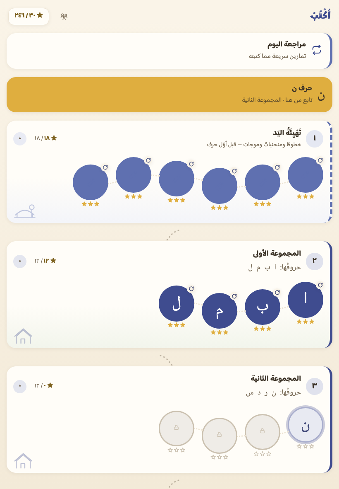</a> الخريطة</td>
<td align="center" width="33%"><a href="identity/indigo-warm-board.png">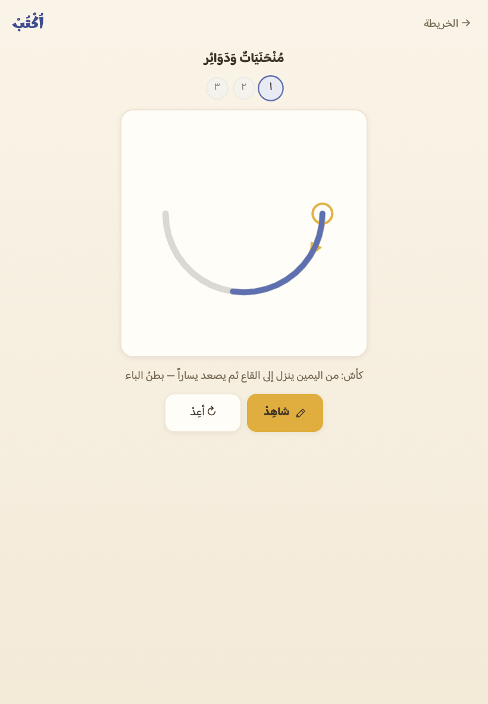</a> لوحُ الكتابة — محاولةٌ وإرشادُها</td>
<td align="center" width="33%"> الاحتفال</td>
</tr></table>

**ما نزل عن أرضيةٍ**:

- ⚠ `accent-garden`: فصلُ حبر الطفل عن النموذج المرسوم 26.7 دون أرضية اقرأ 27.5
- ⚠ تمايزُ المراحل بعضِها عن بعض 8.6 دون أرضية اقرأ 10.8

### **الأرضيةُ معدَّلة** — ورقُ كرّاسةٍ أبردُ من ورق العائلة وحبرٌ أقلُّ دفئاً — تشتدّ به زُرقةُ الحبر النِّيليّ.

الورق <code>#F4F4F1</code> · البطاقة <code>#FFFFFE</code> · الحبر <code>#34322E</code> — حبرٌ على ورق **11.61:١**، وثانويٌّ **4.83:١**، وبُعدُ الورق عن ورق اقرأ **4.4** وعن ورق احسب **2.4**.

<table><tr>
<td align="center" width="33%"><a href="identity/indigo-tuned-map.png">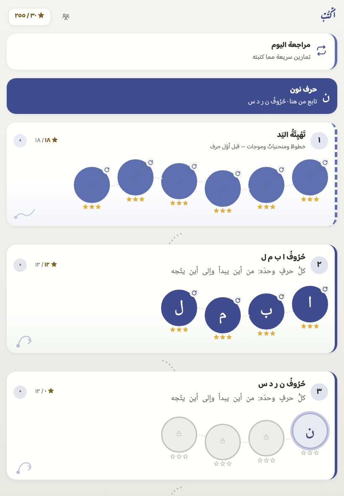</a> الخريطة</td>
<td align="center" width="33%"><a href="identity/indigo-tuned-board.png">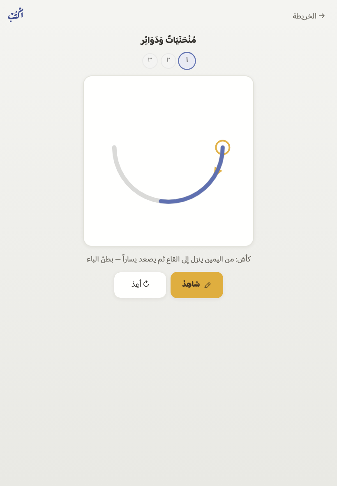</a> لوحُ الكتابة — محاولةٌ وإرشادُها</td>
<td align="center" width="33%"><a href="identity/indigo-tuned-celebrate.png">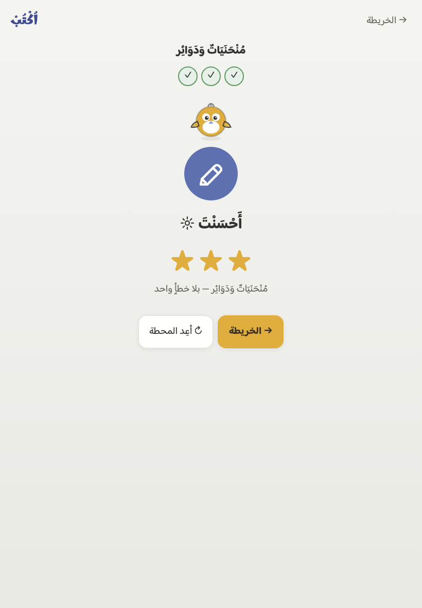</a> الاحتفال</td>
</tr></table>

**ما نزل عن أرضيةٍ**:

- ⚠ `accent-stories`: فصلُ حبر الطفل عن النموذج المرسوم 26.3 دون أرضية اقرأ 27.5
- ⚠ `accent-garden`: فصلُ حبر الطفل عن النموذج المرسوم 24.2 دون أرضية اقرأ 27.5
- ⚠ تمايزُ المراحل بعضِها عن بعض 8.6 دون أرضية اقرأ 10.8

## ٣.٢ — «أُرْجُوانُ الحِبْر»

**الاستعارة**: المِحبرةُ الأرجوانية — لونُ الحبر القديم بين النِّيل والتُّوت

**لماذا**: وسطُ الحيّز الحرّ: دافئٌ بعضَ الدفء فلا يبرد على الورق الكريميّ، وغنيٌّ ينفع للعلامة والأيقونة. ونسقُه أوسعُ ما يعطي المراحلَ الخمسَ تمايزاً داخلياً بلا صراخ.

**وما يُخشى منه**: أقربُ المرشّحات إلى بنفسجيّ اقرأ الثانوي (المهارات) وبنفسجيّ احسب (الأنماط) — والأرقامُ في اللوحة.

| المرحلة | اللون | نصُّه فوقه | فصلُه عن النموذج المرسوم | أقربُ أخ | أقربُ لون حكم |
|---|---|---|---|---|---|
| الخفوتُ والإملاءُ والجمل — خاتمةُ الرحلة | <code>#4A2261</code> | 12.41:١ | 67.7 | read.accent-skills 25.5 | err 37.8 |
| الحرفُ المعزول — لونُ التطبيق الغالب | <code>#6F4487</code> | 7.36:١ | 50.9 | read.accent-skills 14.7 | err 31.4 |
| التهيئةُ الحركية والبوابات | <code>#A2578F</code> | 4.89:١ | 41.2 | read.accent-skills 12.0 | err 22.1 |
| الوصلُ والنسخ | <code>#C295D0</code> | 4.94:١ | 28.8 | calc.accent-pattern 10.1 | err 28.5 |
| أشكالُ المواقع | <code>#EFB2DE</code> | 7.03:١ | 25.0 | calc.accent-pattern 20.3 | err 29.7 |

**العلامة**: <code>#B06FC6</code> <code>#8A4CA6</code> <code>#4A2261</code> — وبها تُعاد الأيقونةُ بعد الحكم.

### **الأرضيةُ الدافئة كما هي** (موحّدةُ العائلة)

الورق <code>#FAF4E8</code> · البطاقة <code>#FFFDF8</code> · الحبر <code>#3D3428</code> — حبرٌ على ورق **11.14:١**، وثانويٌّ **4.80:١**، وبُعدُ الورق عن ورق اقرأ **0.0** وعن ورق احسب **2.2**.

<table><tr>
<td align="center" width="33%"><a href="identity/violet-warm-map.png">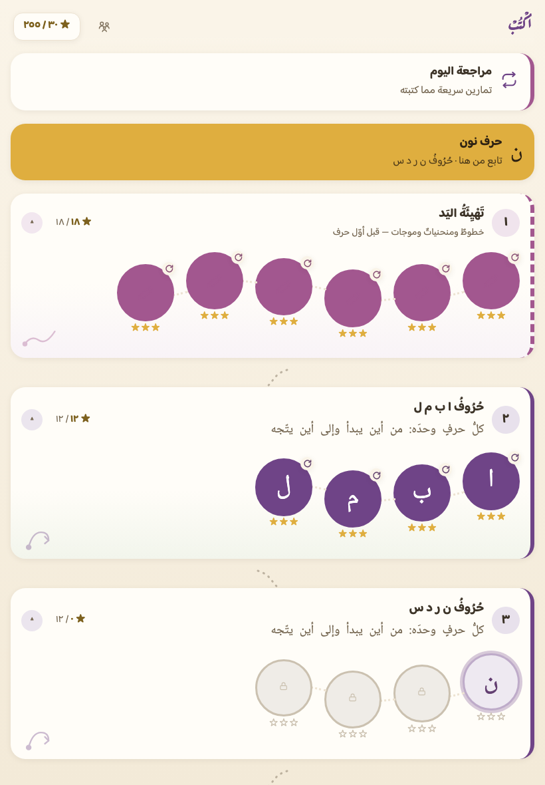</a> الخريطة</td>
<td align="center" width="33%"> لوحُ الكتابة — محاولةٌ وإرشادُها</td>
<td align="center" width="33%"> الاحتفال</td>
</tr></table>

**ما نزل عن أرضيةٍ**:

- ⚠ `accent-garden`: فصلُ حبر الطفل عن النموذج المرسوم 25.0 دون أرضية اقرأ 27.5
- ⚠ تمايزُ المراحل بعضِها عن بعض 10.6 دون أرضية اقرأ 10.8

### **الأرضيةُ معدَّلة** — ورقٌ رمليٌّ فاتح يميل عن الأصفر إلى الوردة — يبقى الدفءُ ويهدأ صُفارُه.

الورق <code>#F9F4F1</code> · البطاقة <code>#FFFDFB</code> · الحبر <code>#3A302E</code> — حبرٌ على ورق **11.72:١**، وثانويٌّ **5.03:١**، وبُعدُ الورق عن ورق اقرأ **4.2** وعن ورق احسب **2.3**.

<table><tr>
<td align="center" width="33%"><a href="identity/violet-tuned-map.png">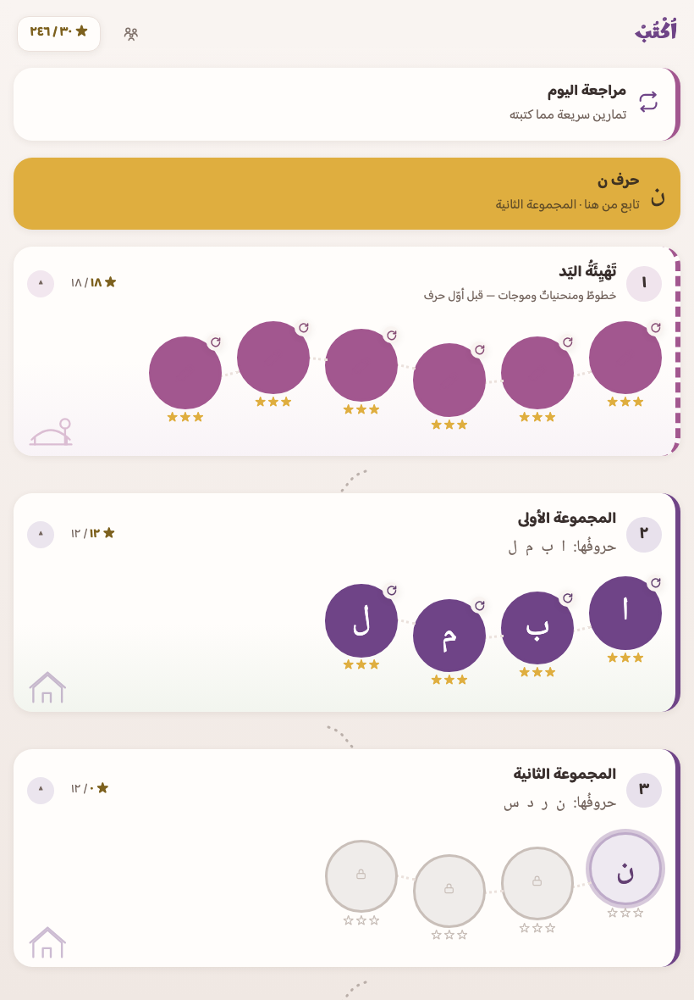</a> الخريطة</td>
<td align="center" width="33%"><a href="identity/violet-tuned-board.png">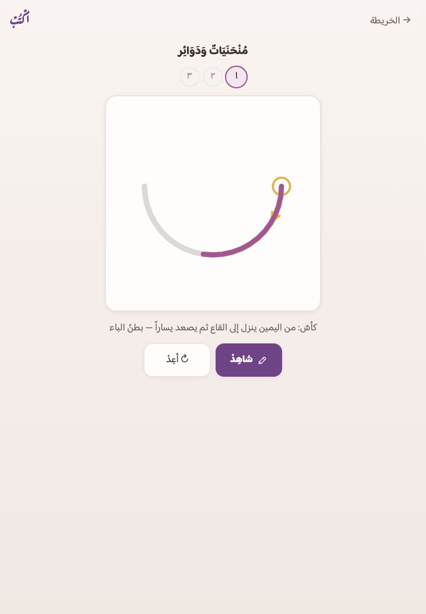</a> لوحُ الكتابة — محاولةٌ وإرشادُها</td>
<td align="center" width="33%"> الاحتفال</td>
</tr></table>

**ما نزل عن أرضيةٍ**:

- ⚠ `accent-stories`: فصلُ حبر الطفل عن النموذج المرسوم 25.9 دون أرضية اقرأ 27.5
- ⚠ `accent-garden`: فصلُ حبر الطفل عن النموذج المرسوم 22.0 دون أرضية اقرأ 27.5
- ⚠ تمايزُ المراحل بعضِها عن بعض 10.6 دون أرضية اقرأ 10.8

## ٣.٣ — «تُوتٌ وعُنّاب»

**الاستعارة**: مِدادُ التُّوت — أدفأُ الأحبار وأقربُها إلى ورق العائلة

**لماذا**: أبعدُ المرشّحات عن أخويه بالرقم، وأدفؤها: يجلس على الورق الكريميّ كأنه منه. وفيه بهجةٌ لعينِ طفلٍ لا يبلغها النِّيليّ.

**وما يُخشى منه**: أقربُ المرشّحات إلى أحمر الخطأ (`--err`) — والفصلُ مقيسٌ في اللوحة، ولا يُقبل مرشّحٌ يلتبس بلون حكم.

| المرحلة | اللون | نصُّه فوقه | فصلُه عن النموذج المرسوم | أقربُ أخ | أقربُ لون حكم |
|---|---|---|---|---|---|
| الخفوتُ والإملاءُ والجمل — خاتمةُ الرحلة | <code>#66264D</code> | 10.77:١ | 61.7 | read.accent-skills 25.9 | err 29.6 |
| الحرفُ المعزول — لونُ التطبيق الغالب | <code>#8F3A6A</code> | 7.04:١ | 49.6 | read.accent-skills 19.9 | err 23.1 |
| التهيئةُ الحركية والبوابات | <code>#AF5580</code> | 4.74:١ | 40.3 | read.accent-skills 16.5 | err 17.2 |
| الوصلُ والنسخ | <code>#EE97AE</code> | 5.62:١ | 26.8 | calc.accent-pattern 22.0 | err 20.1 |
| أشكالُ المواقع | <code>#DFACE8</code> | 6.51:١ | 26.4 | calc.accent-pattern 16.8 | err 31.7 |

**العلامة**: <code>#D06A96</code> <code>#A54174</code> <code>#66264D</code> — وبها تُعاد الأيقونةُ بعد الحكم.

### **الأرضيةُ الدافئة كما هي** (موحّدةُ العائلة)

الورق <code>#FAF4E8</code> · البطاقة <code>#FFFDF8</code> · الحبر <code>#3D3428</code> — حبرٌ على ورق **11.14:١**، وثانويٌّ **4.80:١**، وبُعدُ الورق عن ورق اقرأ **0.0** وعن ورق احسب **2.2**.

<table><tr>
<td align="center" width="33%"><a href="identity/mulberry-warm-map.png">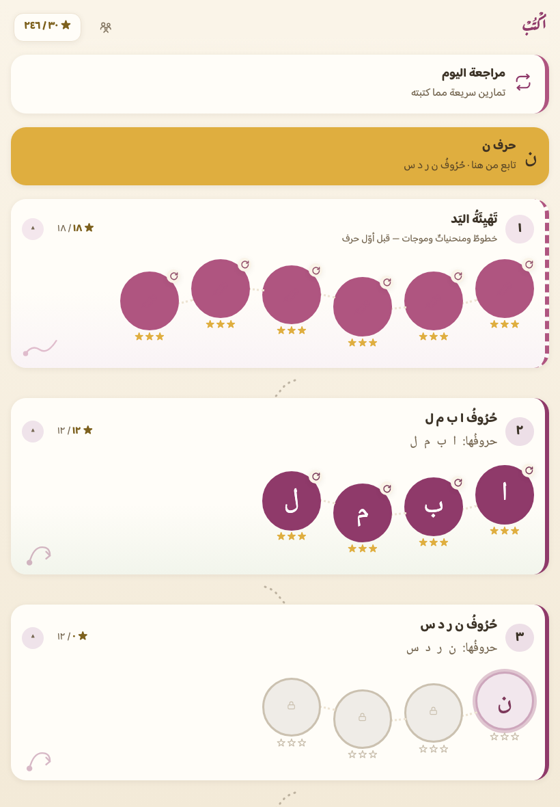</a> الخريطة</td>
<td align="center" width="33%"><a href="identity/mulberry-warm-board.png">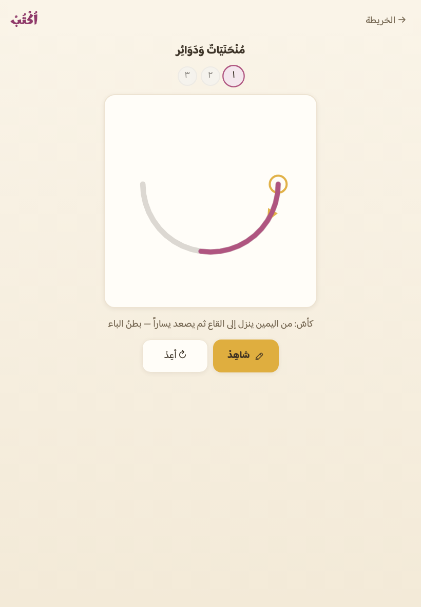</a> لوحُ الكتابة — محاولةٌ وإرشادُها</td>
<td align="center" width="33%"><a href="identity/mulberry-warm-celebrate.png">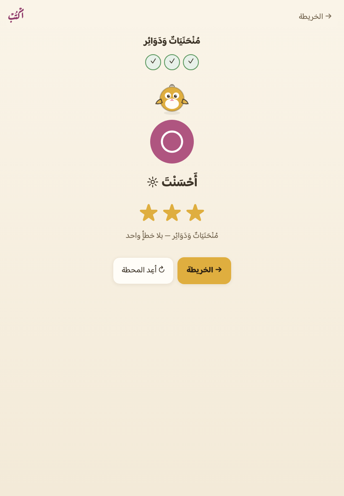</a> الاحتفال</td>
</tr></table>

**ما نزل عن أرضيةٍ**:

- ⚠ `accent-stories`: فصلُ حبر الطفل عن النموذج المرسوم 26.8 دون أرضية اقرأ 27.5
- ⚠ `accent-garden`: فصلُ حبر الطفل عن النموذج المرسوم 26.4 دون أرضية اقرأ 27.5
- ⚠ تمايزُ المراحل بعضِها عن بعض 9.7 دون أرضية اقرأ 10.8

### **الأرضيةُ معدَّلة** — ورقٌ ورديٌّ خافت أدفأُ من ورق العائلة — يجلس عليه التوتُ كأنه منه.

الورق <code>#FCF2EE</code> · البطاقة <code>#FFFCFA</code> · الحبر <code>#3C2F2C</code> — حبرٌ على ورق **11.67:١**، وثانويٌّ **4.94:١**، وبُعدُ الورق عن ورق اقرأ **4.9** وعن ورق احسب **3.7**.

<table><tr>
<td align="center" width="33%"><a href="identity/mulberry-tuned-map.png">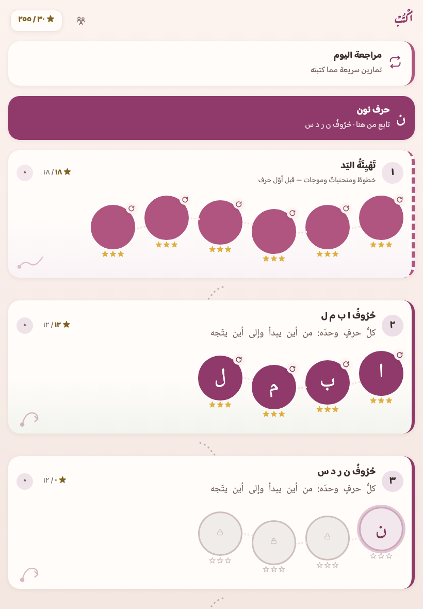</a> الخريطة</td>
<td align="center" width="33%"><a href="identity/mulberry-tuned-board.png">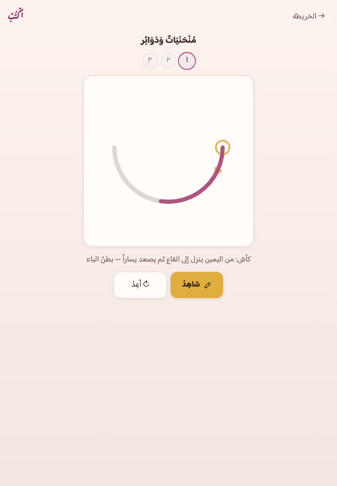</a> لوحُ الكتابة — محاولةٌ وإرشادُها</td>
<td align="center" width="33%"> الاحتفال</td>
</tr></table>

**ما نزل عن أرضيةٍ**:

- ⚠ `accent-stories`: فصلُ حبر الطفل عن النموذج المرسوم 24.1 دون أرضية اقرأ 27.5
- ⚠ `accent-garden`: فصلُ حبر الطفل عن النموذج المرسوم 23.1 دون أرضية اقرأ 27.5
- ⚠ تمايزُ المراحل بعضِها عن بعض 9.7 دون أرضية اقرأ 10.8

## ٤. المقابلة — الشاشةُ الواحدة بألواحها الأربعة

**على الأرضية الدافئة** — وأوّلُ عمودٍ **لوحُ التطبيق كما هو الآن**: الحكمُ مطبَّقٌ فيه، فمطابقتُه لعمود المرشَّح المحكوم له شهادةٌ بالصورة على أنّ ما لُبس هو ما حُكم له،
وأرضيةُ كلِّ مرشَّحٍ المعدَّلة في بابه أعلاه.

**الخريطة**

<table><tr>
<td align="center" width="25%"><a href="identity/now-warm-map.png">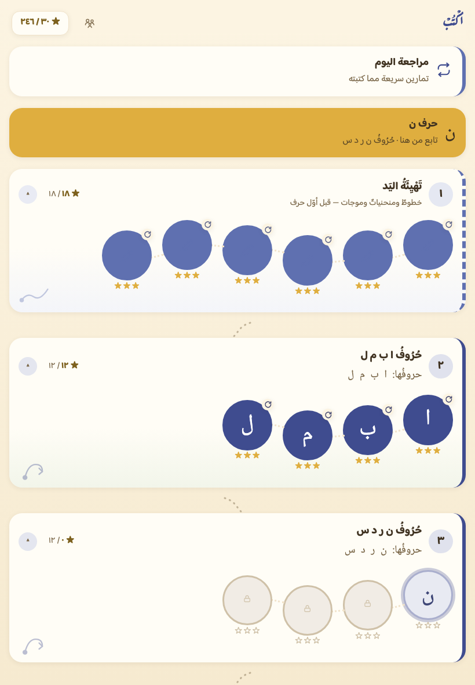</a> لوحُ التطبيق الآن</td>
<td align="center" width="25%"> حِبْرٌ نِيليّ</td>
<td align="center" width="25%"> أُرْجُوانُ الحِبْر</td>
<td align="center" width="25%"> تُوتٌ وعُنّاب</td>
</tr></table>

**لوحُ الكتابة — محاولةٌ وإرشادُها**

<table><tr>
<td align="center" width="25%"><a href="identity/now-warm-board.png">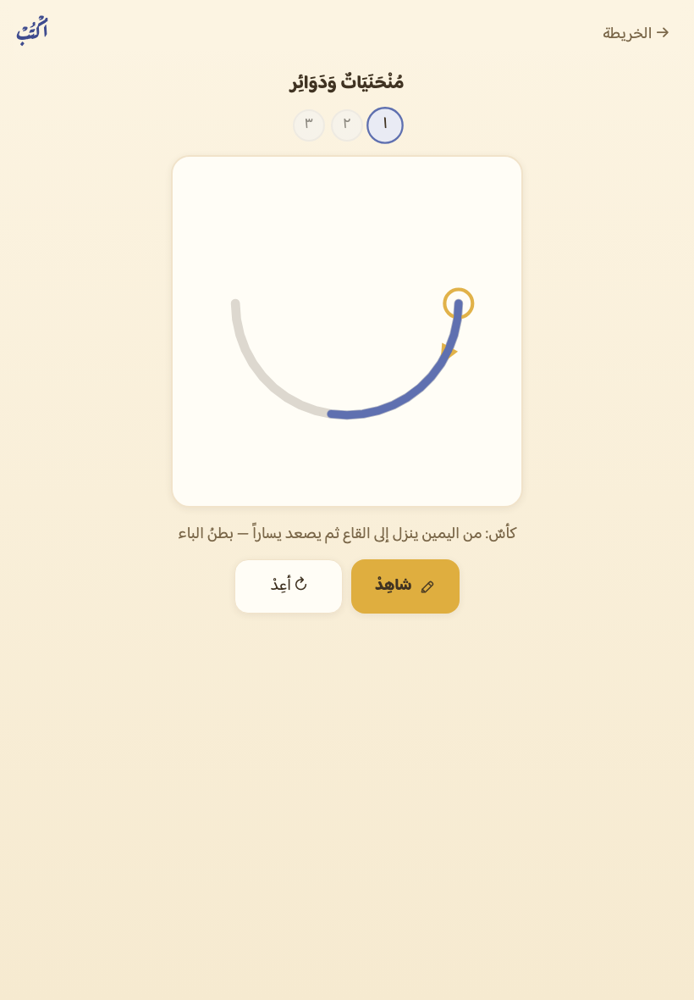</a> لوحُ التطبيق الآن</td>
<td align="center" width="25%"> حِبْرٌ نِيليّ</td>
<td align="center" width="25%"> أُرْجُوانُ الحِبْر</td>
<td align="center" width="25%"> تُوتٌ وعُنّاب</td>
</tr></table>

**الاحتفال**

<table><tr>
<td align="center" width="25%"> لوحُ التطبيق الآن</td>
<td align="center" width="25%"> حِبْرٌ نِيليّ</td>
<td align="center" width="25%"> أُرْجُوانُ الحِبْر</td>
<td align="center" width="25%"> تُوتٌ وعُنّاب</td>
</tr></table>

## ٥. سؤالٌ مفتوحٌ يخصّ الذهب

`--star` يحمل اليومَ ثلاثةَ أدوارٍ في «اُكْتُبْ»: **الإرشاد** (نقطةُ البداية والسهم) و**النجوم**
و**الفعلُ الرئيس** (زرُّ «تابع من هنا» وأخواته). فبقاؤه ذهبياً — وهو نصُّ البند —
يُبقي أكبرَ مساحةٍ ملوّنة في الخريطة ذهبيةً في المرشّحات الثلاثة كلِّها.

**وثالثةٌ تُقرأ في اللقطات**: طائرُ العائلة نفسُه من الذهب — `mascot()` يرسم ريشَه
بـ`--star` — فهو واحدٌ في التطبيقات الثلاثة ما دام الذهبُ محفوظاً.

**والبابُ المفتوح** (لا يُفتَح إلا بأمر): يُشقّ `--guide` عن `--star` فيبقى الإرشادُ ذهبياً
بدلالته ويتحرّر لونُ الفعل الرئيس إلى الهوية — كما فعل احسب (نجمتُه فيروزية).
**ولم يُفعل اليوم**: البندُ يقول «لا تُمَسّ ألوانُ الحكم»، والإرشادُ منها.

## ٦. الأرضيةُ الدافئةُ المزاحة — لوحةٌ مكمّلة لـ«حِبْرٌ نِيليّ»

> **حكمُ المالك في اللوحة أعلاه**: الغالبُ «حِبْرٌ نِيليّ»، **والأرضيةُ دافئةٌ
> مُزاحة** — تبقى دافئةً بالعين وتقيس مخالفةً لورق اقرأ. وهي أرضيةٌ **لم تكن في
> اللوحة الأولى**: «الدافئةُ كما هي» بُعدُها عن ورق اقرأ **٠٫٠** فيردّها حارسُ
> الميثاق القادم (`FAMILY §٩`)، و«المعدَّلة» ورقٌ بارد. فاشتُقّت ثالثةٌ وصُيِّرت
> **لتُرى قبل أن يُكتب الحكم** — فلا يُعتمد لونٌ لم تره عين.

**والإزاحةُ تُشتقّ بقياسٍ معلَن لا بذوق** — ثلاثةُ مطالبَ في العبارة، ثلاثةُ أرقامٍ في الاشتقاق:

1. **كم تُزاح؟** — لا عتبةَ تُخترع. وفي العائلة سابقةٌ واحدة لورقٍ اختار نفسَه: **احسب**. فبُعدُ ورقه عن ورق اقرأ **خطوةُ أخٍ** — وهي الأرضية: ΔE₀₀ = **2.17**. فمن بلغها خالف بمقدارِ ما خالف به أخٌ فعلاً، لا بمقدارِ ما استُحسن.
2. **كيف تبقى دافئة؟** — الإزاحةُ **في الدفء لا منه**: يُضرب إشباعُ لوح اقرأ في معاملٍ واحد **والإضاءةُ والصبغةُ لا تُمَسّان**. فالورقُ يزداد كِرَميّةً ولا يبرد، وصبغتُه صبغةُ العائلة بعينها.
3. **وكم بالضبط؟** — **أصغرُ معاملٍ يبلغ الخطوة**: `k` = **1.442** ⇐ ورقٌ <code>#FCF4E2</code> على **2.33** من ورق اقرأ. ولا يُنفَق أكثرُ مما يطلبه الميثاق: ما دونه (1.362 ⇐ <code>#FCF4E3</code>) ينزل عن الخطوة بـ**1.97**. **والمقياسُ على القيمة الثمانيّة التي تُكتب في اللوح** لا على المتّصل الرياضيّ — فما لا يُكتب لا يُقاس.

**وللمعامل جهتان، وسقطت إحداهما بالرقم**: دون الواحد يبرد الورقُ (`k` = 0.558 ⇐ <code>#F8F4EE</code>)، فيبلغ خطوةَ اقرأ (**2.61**) **ثم يجلس في حِجر احسب**: على **0.54** من ورقه وحدَه — أي يخالف أخاً ويزاحم أخاً. والجهةُ الدافئة تبعد عن **الاثنين معاً**: 2.33 عن اقرأ و**4.48** عن احسب. فالاتجاهُ حكمُ رقمٍ لا ميلُ عين.

| رمزُ الأرضية | لوحُ اقرأ | المزاح | ΔE₀₀ |
|---|---|---|---|
| `--paper` | <code>#FAF4E8</code> | <code>#FCF4E2</code> | 2.33 |
| `--paper-deep` | <code>#F3EAD8</code> | <code>#F6EAD0</code> | 2.79 |
| `--card` | <code>#FFFDF8</code> | <code>#FFFDF6</code> | 0.96 |
| `--ink` | <code>#3D3428</code> | <code>#403322</code> | 2.85 |
| `--ink-soft` | <code>#786A55</code> | <code>#7C694B</code> | 3.39 |
| `--line` | <code>#EDE3D2</code> | <code>#F1E3CA</code> | 2.90 |
| `--locked` | <code>#CBC1B0</code> | <code>#CFC1A8</code> | 2.96 |

**وربحٌ يلزم عن (٢) بالبرهان لا بالتجربة**: تباينُ WCAG دالّةُ الإضاءة النسبية
وحدَها، و`L*` دالّتُها هي الأخرى — فما دامت `L*` لم تُمَسّ فكلُّ تباينٍ في لوح اقرأ
**محفوظٌ بعينه**. والمقيسُ يشهد: أقصى ما تحرّك تباينٌ **0.041** (وهو حَفُّ
التدوير إلى ثماني بتّات):

| التباين | لوحُ اقرأ | المزاح |
|---|---|---|
| الحبرُ على الورق | 11.14:١ | 11.18:١ |
| الثانويُّ على الورق | 4.80:١ | 4.82:١ |
| الحبرُ على البطاقة | 12.01:١ | 12.03:١ |
| المقفلُ على الورق | 1.63:١ | 1.62:١ |

**وواحدٌ يُعلَن ولا يُخبَّأ — البطاقةُ على جدار المجال**: `--card` يبلغ حدَّ sRGB قبل تمام الإزاحة (وهو عند اقرأ نفسِه على الحدّ: أحمرُه ٢٥٥)، فيأخذ ما يسعه المجالُ: **1.378** من **1.442**. **والمقيسُ ما كُتب لا ما أُريد** — والأرقامُ أعلاه من القيمة المكتوبة.

**وحصيلةُ الأرضيات الثلاث على «حِبْرٌ نِيليّ»** — وأنفسُها **فصلُ حبر الطفل عن
النموذج المرسوم**، أوّلُ ما تراه عينُه على اللوح:

| الأرضية | الورق | عن ورق اقرأ | عن ورق احسب | حبرٌ على ورق | أدنى فصلِ حبر | ما نزل عن أرضيةٍ |
|---|---|---|---|---|---|---|
| الدافئةُ كما هي | <code>#FAF4E8</code> | 0.0 | 2.2 | 11.14:١ | 26.7 | ٢ |
| المعدَّلة (باردة) | <code>#F4F4F1</code> | 4.4 | 2.4 | 11.61:١ | 24.2 | ٣ |
| **المزاحة** | <code>#FCF4E2</code> | 2.3 | 4.5 | 11.18:١ | 28.3 ✓ | ١ |

**وأرضيةُ اقرأ في فصل الحبر 27.5** — فالمزاحةُ وحدَها تعلوها:
ورقٌ أدفأ يدفع النموذجَ المرسوم إلى الدفء، فيزداد فصلُه عن حبرٍ نيليٍّ بارد.
**والشكوى التي كانت على الدافئة سقطت** ولم يُشترَ ذلك بحرفٍ خفت.

**وما بقي تحت أرضيةٍ في المزاحة**:

- ⚠ تمايزُ المراحل بعضِها عن بعض 8.6 دون أرضية اقرأ 10.8

(وهي شكوى بنيويةٌ في كل مرشَّحٍ ذي هويةٍ غالبةٍ واحدة — علّتُها في §٢،
ولا تخصّ الأرضية: رقمُها واحدٌ في الأرضيات الثلاث.)

**وماذا ترى العينُ؟ — يُقال صريحاً**: الإزاحةُ **صغيرةٌ بالقصد** (لا تُنفَق مخالفةٌ
أكثرُ مما يطلبه الميثاق): 2.33 ΔE₀₀ فرقٌ يُرى إن صُفَّ الورقان
جنباً إلى جنب — كما في المقابلة أدناه — ولا يُرى وحدَه. **وهذا نصُّ المطلوب**:
«تبقى دافئةً بالعين وتقيس مخالفة». فمن أراد فرقاً يصرخ فليس هذا بابَه؛ والمزاحةُ
في المقابلة أدفأُ من الدافئة نفسِها لا أبردُ منها (إشباعُ ورقها 9.6
وإشباعُ ورق اقرأ 6.5).

### اللقطات — «حِبْرٌ نِيليّ» على الأرضية المزاحة

<table><tr>
<td align="center" width="33%"><a href="identity/indigo-shift-map.png">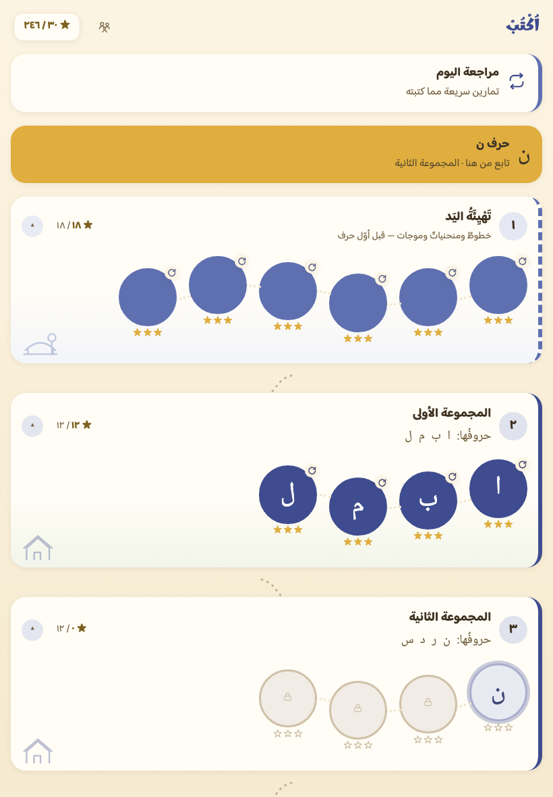</a> الخريطة</td>
<td align="center" width="33%"> لوحُ الكتابة — محاولةٌ وإرشادُها</td>
<td align="center" width="33%"><a href="identity/indigo-shift-celebrate.png">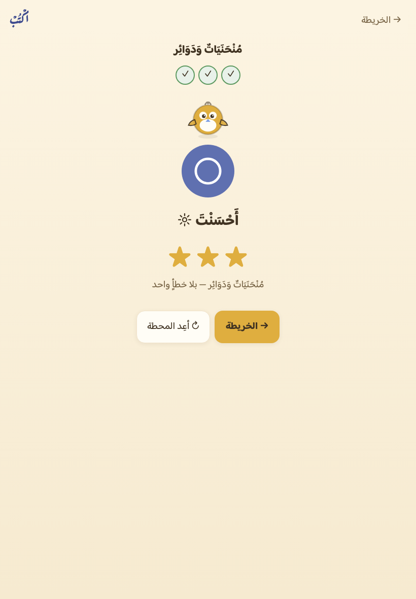</a> الاحتفال</td>
</tr></table>

**والمقابلةُ بالأرضيات الثلاث** — الغالبُ واحدٌ في الأعمدة الثلاثة، والمتبدّلُ الورقُ وحدَه:

**الخريطة**

<table><tr>
<td align="center" width="33%"> الدافئةُ كما هي</td>
<td align="center" width="33%"> المعدَّلة (باردة)</td>
<td align="center" width="33%"> المزاحة</td>
</tr></table>

**لوحُ الكتابة — محاولةٌ وإرشادُها**

<table><tr>
<td align="center" width="33%"> الدافئةُ كما هي</td>
<td align="center" width="33%"> المعدَّلة (باردة)</td>
<td align="center" width="33%"> المزاحة</td>
</tr></table>

**الاحتفال**

<table><tr>
<td align="center" width="33%"> الدافئةُ كما هي</td>
<td align="center" width="33%"> المعدَّلة (باردة)</td>
<td align="center" width="33%"> المزاحة</td>
</tr></table>

**والمطلوبُ من هذه اللوحة سطرٌ واحد**: إن رضيت عينُك الأرضيةَ المزاحة فالحكمُ
`indigo / shift` يُكتب في §٧ أدناه؛ وإن آثرتَ سواها فـ`indigo / warm`
أو `indigo / tuned`. **ولا يُصبَغ اللوحُ حتى يُكتب** — والحارسُ على الطرفين.

## ٧. حكمُ المالك

يُكتب هنا بمعرّف المرشَّح والأرضية — مثلاً `mulberry / tuned` أو `indigo / warm`،
والأرضياتُ: `warm` (الدافئةُ كما هي) · `tuned` (المعدَّلة) · `shift` (**الدافئةُ المزاحة**، §٦ — ولها وحدَها من المرشّحين `indigo`)،
والمعرّفاتُ: `indigo` (حِبْرٌ نِيليّ) · `violet` (أُرْجُوانُ الحِبْر) · `mulberry` (تُوتٌ وعُنّاب).

<!-- ⇩ يُحفَظ عند إعادة التوليد: بابُ المالك — حكمُه وما يُرفَع إليه ⇩ -->
---

## مراجعةُ المدير ورفعُه للمالك (١٢ أغسطس ٢٠٢٦)

قُرئت اللقطاتُ الإحدى والعشرون بالعين، وشُغّل الحارسُ (`--self-test` ٣٣/٣٣)، والسَّوقةُ خضراء. **وتوصيةُ المدير: `indigo` — حِبْرٌ نِيليّ**، بثلاث:
1. **هو الاستعارةُ البطلة نفسُها** (`FAMILY §٩.٣`: عالمُ اكتب القلمُ والأثر): حبرُ الطفل على اللوح يُرى **حبراً نيلياً حقيقياً** — الهويةُ والمادةُ تصيران شيئاً واحداً.
2. **لسانُ الإرشاد أوضح ما يكون عليه**: الذهبُ (نقطةُ البداية والسهم) على النيلي أبعدُ فصلاً منه على الأرجوان والتوت — والإرشادُ أثمنُ ما في الشاشة.
3. **التوتُ والأرجوان حبرُهما على اللوح يقارب أحمرَ المصحح** في عين من ألِف كراساتِ المدرسة — والطفل يكتب به لا يُصحَّح.

**وفي الأرضية قيدُ الميثاق**: «الدافئة كما هي» بُعدُها عن ورق اقرأ **٠٫٠** — وحارسُ الهوية الميثاقيّ (`FAMILY §٩`، يُبنى في هـ٢) يطالب الورقَ والغالبَ بمخالفة قيم اقرأ. فالخياران المستقيمان: **`tuned`**، أو أرضيةٌ دافئةٌ **مُزاحة قياساً** (تبقى دافئةً بالعين وتقيس مختلفة — إن طلبها المالك فهي عملُ سطرٍ في هـ٢ وتُصيَّر له قبل الاعتماد).

والحكمُ للمالك وحده — يُكتب في السطر أدناه.

**الحكم**: indigo / shift
<!-- ⇧ ينتهي المحفوظ ⇧ -->

> وما دام الحكمُ منتظَراً فـ`app/css/app.css` يبقى لوحَ البذرة، **يحرسه**
> `python3 tools/identity_panel.py --self-test`: يحمرّ إن طُبِّق لونٌ بلا حكمٍ
> مكتوب هنا، ويحمرّ إن كُتب الحكمُ ولم يطابقه اللوحُ حرفاً.
