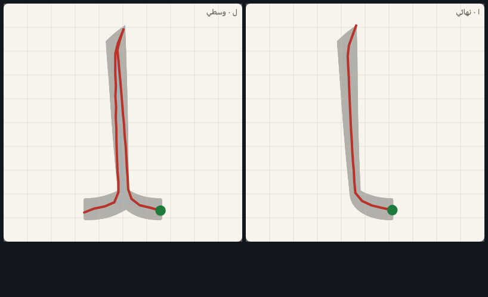
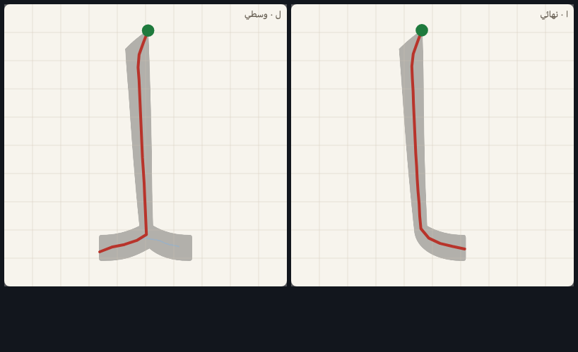
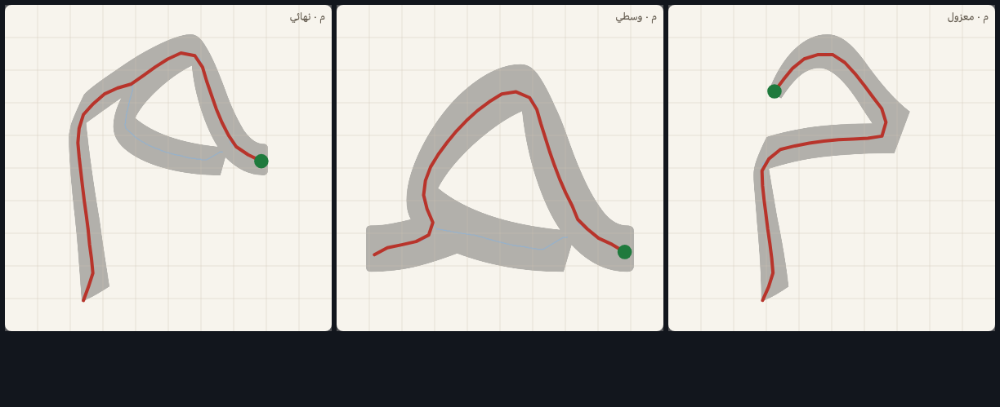
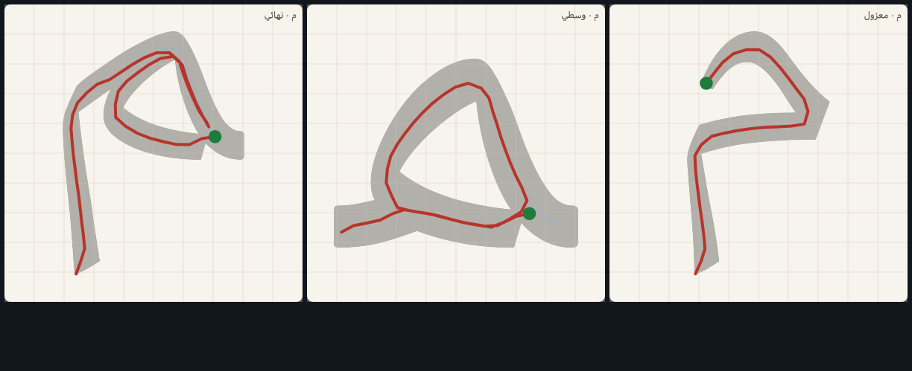
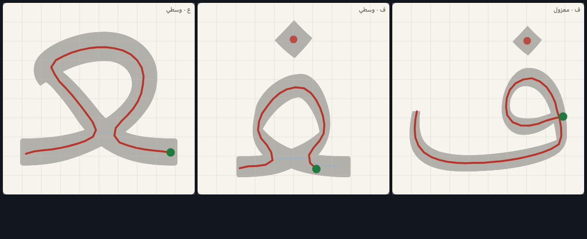
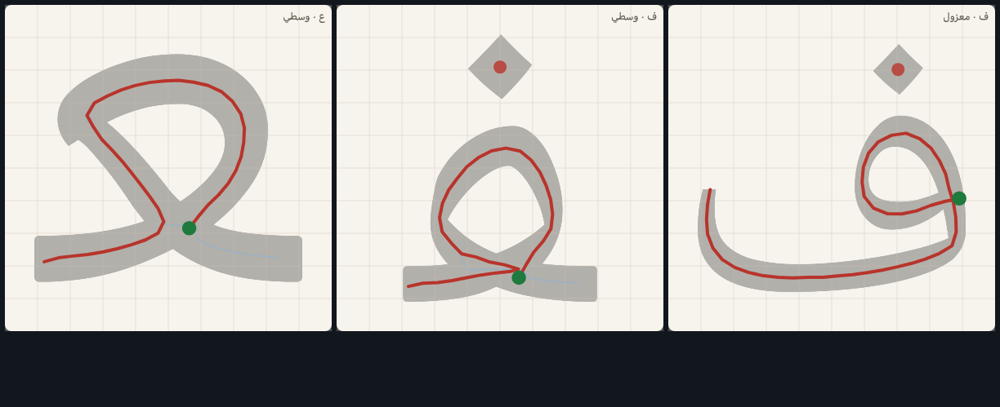
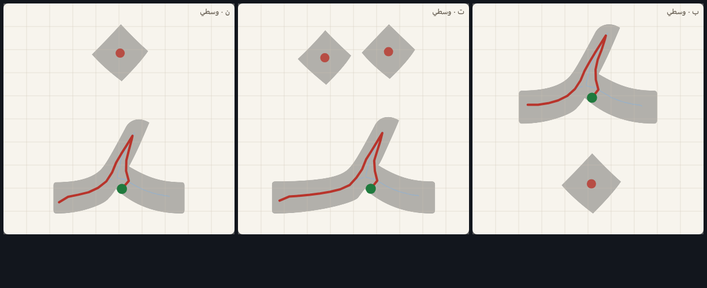
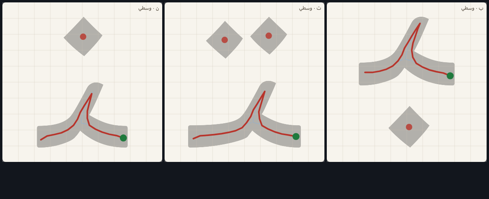
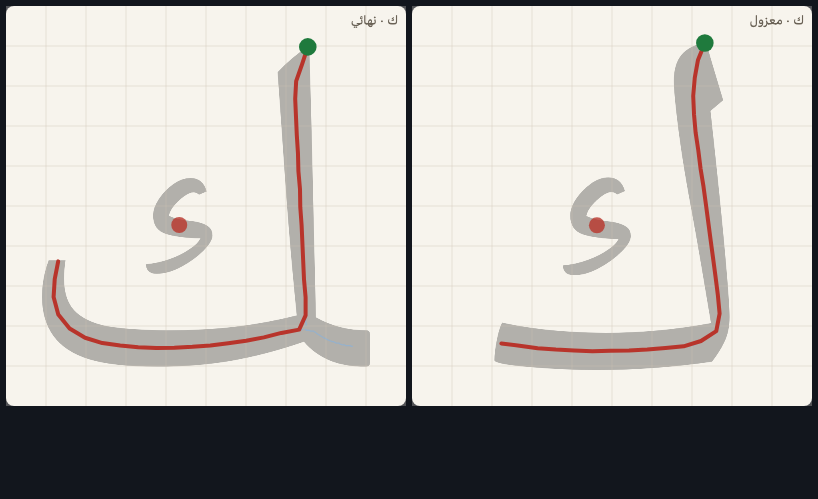

# مرجعيةُ الكرّاسة — الحالاتُ الحركية وجواباها وحكمُ المالك فيها

> ⚠ **ملفٌّ مولَّد** — لا يُحرَّر بيد إلا **أبوابُ حكم المالك** (يحفظها المولّد):
>
>     python3 tools/craft_panel.py
>
> **الاتجاهُ هو المادةُ المدرَّسة** (`METHOD.md §١`)، فلا يجوز أن تُكتب الحالةُ
> الحركيةُ الواحدة بجوابين في منهجٍ واحد. وهذه الصفحةُ تعرض كلَّ حالةٍ
> **بجوابيها مبنيَّين مصوَّرَين مقيسَين**، وتحت كلٍّ **حكمُ المالك بتاريخه**.
> **والمحكومُ فيه اليومَ ٥ من ٥** — والمُقَرُّ منها
> **مطبَّقٌ في الإيماءة بعينه**، يفحص ذلك `craft_panel.py --self-test`: حكمٌ
> يُكتب هنا ولا يُنفَّذ في `path_anchors.json` يحمرّ من نفسه.

**كيف تُقرأ اللقطة؟** الرماديُّ الباهت خيالُ الحرف بخطّ النسخ المدرسيّ (ق٢)،
والأزرقُ هيكلُه (مسارُ القلم في قلب الحبر)، **والأحمرُ المسارُ المؤلَّف** ونقطتُه
الخضراء **بدايةُ القلم**. فما تراه هو ما سيراه الطفلُ متحركاً وما سيحكم به المحرّك.

**وشاهدُ الكرّاسة**: خطُّ النسخ المعتمد نفسُه (منه الخيالُ والهيكل) وقياسُ المحرّك.
**ولا صورةَ كرّاسةٍ ورقية في المستودع** — فما استند إلى عادة التدريس مكتوبٌ أنه
كذلك، ولا يُدَّعى شاهدٌ لم يُرَ.

## ١. العمودُ الموصول: أيصعد من قدمه أم ينزل من قمّته؟

الألفُ المعزولة تنزل من قمّتها بإجماع الكرّاسات — فماذا عن الألف الموصولة (ـا) وعمود اللام حين يبلغهما القلمُ آتياً على السطر من الحرف قبلهما؟

<table><tr>
<td align="center" width="50%"> يصعد من قدمه (الحاليّ)</td>
<td align="center" width="50%"> ينزل من قمّته (كالمعزول)</td>
</tr></table>

### يصعد من قدمه (الحاليّ)

- **شاهدُه**: **اتّصالُ الحركة**: القلمُ يبلغ الألفَ الموصولة على السطر آتياً من الحرف قبلها، فالصعودُ يُبقي الكلمةَ حركةً واحدة لا رفعَ فيها. وهو الذي يُرى في كرّاسات النسخ حين تُكتب الكلمةُ كاملةً بخطٍّ واحد.
- **ثمنُه**: يُعلَّم الطفلُ للحرف الواحد اتجاهان: نازلٌ معزولاً وصاعدٌ موصولاً.
- **وقياسُ المحرّك عليه**:

| الشكل | ما قاله المحرّك |
|---|---|
| ا نهائي | أجزاء ١ · يُقبَل صحيحاً ✓ · ويُرَدّ معكوساً ✓ · هامشُ الرجفة ٦٦ ✓ |
| ل وسطي | أجزاء ١ · طيّاتٌ معلَنة ١ · يُقبَل صحيحاً ✓ · ويُرَدّ معكوساً ✓ · هامشُ الرجفة ٩٠ ✓ · الخطُّ الواحد يُقبَل ✓ · الأثرُ الرطب يُقبَل ✓ |

### ينزل من قمّته (كالمعزول)

- **شاهدُه**: **قاعدةُ الكرّاسة الأولى**: «كلُّ عمودٍ يُكتب من أعلى إلى أسفل» — وهي أوّلُ ما يُقوَّم في خطّ الطفل، ونقضُها في الموصول يزرع عادتين لحرفٍ واحد.
- **ثمنُه**: يُرفَع القلمُ داخل الكلمة (أو يُقطَع اتّصالُ الحركة) عند كل عمودٍ موصول.
- **وقياسُ المحرّك عليه**:

| الشكل | ما قاله المحرّك |
|---|---|
| ا نهائي | أجزاء ١ · يُقبَل صحيحاً ✓ · ويُرَدّ معكوساً ✓ · هامشُ الرجفة ٦٦ ✓ |
| ل وسطي | أجزاء ١ · يُقبَل صحيحاً ✓ · ويُرَدّ معكوساً ✓ · هامشُ الرجفة ٩٠ ✓ |

<!-- ⇩ يُحفَظ عند إعادة التوليد — بابُ المالك: column ⇩ -->
**الحكم**: ✅ **ينزل من قمّته (كالمعزول)** — حكمُ المالك (١٢ أغسطس ٢٠٢٦).

ونُفِّذ على الألف الموصولة وعمود اللام الوسطية **وعمود الهاء النهائية** — وسقطت طيّةُ ل/وسطي: العمودُ ينزل ولا يعود.
<!-- ⇧ ينتهي المحفوظ: column ⇧ -->

## ٢. دورانُ الميم: أتُدار الوسطيةُ والنهائيةُ كالمعزولة؟

حلقةُ الميم المعزولة تُدار **مع عقارب الساعة** وتُغلق. وفي الوسطية والنهائية قاعُ الرأس هو السطرُ نفسُه، فالمسارُ اليومَ **قوسٌ مفتوح يمرّ فوق الرأس عكسَ دورانها**. أنُبقي الفارق أم نوحّد الدوران؟

<table><tr>
<td align="center" width="50%"> قوسٌ مفتوحٌ فوق الرأس (الحاليّ)</td>
<td align="center" width="50%"> حلقةٌ مغلقةٌ مع عقارب الساعة (كالمعزولة)</td>
</tr></table>

### قوسٌ مفتوحٌ فوق الرأس (الحاليّ)

- **شاهدُه**: **قاعُ الرأس هو السطر**: لو أُغلقت الحلقةُ لمشى القلمُ على السطر مرّتين — ذهاباً في القاع وعوداً إلى المخرج — والمحرّكُ يقرأ الثانيةَ ارتداداً (قرارُ الجلسة ٢). والخطُّ نفسُه يريك رأساً مقوّساً على سطره لا حلقةً معلَّقة.
- **ثمنُه**: الميمُ في الكلمة تُكتب بدورانٍ غير دورانها وحدَها.
- **وقياسُ المحرّك عليه**:

| الشكل | ما قاله المحرّك |
|---|---|
| م معزول | أجزاء ١ · يُقبَل صحيحاً ✓ · ويُرَدّ معكوساً ✓ · هامشُ الرجفة ٥٤ ✓ |
| م وسطي | أجزاء ١ · يُقبَل صحيحاً ✓ · ويُرَدّ معكوساً ✓ · هامشُ الرجفة ٩٠ ✓ |
| م نهائي | أجزاء ١ · يُقبَل صحيحاً ✓ · ويُرَدّ معكوساً ✓ · هامشُ الرجفة ٩٠ ✓ |

### حلقةٌ مغلقةٌ مع عقارب الساعة (كالمعزولة)

- **شاهدُه**: **عادةٌ حركيةٌ واحدة للحرف الواحد**: الطفلُ تمرّن على دوران حلقة الميم في التهيئة ثم في المعزولة، فبقاؤه في الوسطية يوفّر عليه عادةً ثانية — وهو ما تفعله كرّاساتُ النسخ حين تعلّم «رأسَ الميم» رسمةً واحدة أينما وقعت.
- **ثمنُه**: يُمشى قاعُ الرأس — وهو السطرُ — مرّتين ليخرج القلمُ إلى ما بعدها.
- **وقياسُ المحرّك عليه**:

| الشكل | ما قاله المحرّك |
|---|---|
| م معزول | أجزاء ١ · يُقبَل صحيحاً ✓ · ويُرَدّ معكوساً ✓ · هامشُ الرجفة ٥٤ ✓ |
| م وسطي | أجزاء ١ · يُقبَل صحيحاً ✓ · ويُرَدّ معكوساً ✓ · هامشُ الرجفة ٥١ ✓ |
| م نهائي | أجزاء ١ · طيّاتٌ معلَنة ١ · يُقبَل صحيحاً ✓ · ويُرَدّ معكوساً ✓ · هامشُ الرجفة ٦٣ ✓ · الخطُّ الواحد يُقبَل ✓ · الأثرُ الرطب يُقبَل ✓ |

<!-- ⇩ يُحفَظ عند إعادة التوليد — بابُ المالك: meem ⇩ -->
**الحكم**: ✅ **حلقةٌ مغلقةٌ مع عقارب الساعة (كالمعزولة)** — حكمُ المالك (١٢ أغسطس ٢٠٢٦).

ونُفِّذ على الوسطية والنهائية معاً، **ومعه حكمُ المدخل (§٤)**: تبدأ الحلقةُ من مقعدها على السطر لا من طرف الوصلة. وثمنُه المعلَن مدفوع: قاعُ الرأس يُمشى مرّتين.
<!-- ⇧ ينتهي المحفوظ: meem ⇧ -->

## ٣. الحلقاتُ ورؤوسُها عامةً: أتُغلَق الحلقةُ التي قاعُها السطر؟

الحلقةُ الحرّة (ف ق معزولةً، و، ه) تُدار من مقعدها وتُغلق عنده. والحلقةُ التي قاعُها السطرُ (ف ق ع وسطيةً، م) لا تُغلَق اليوم. أقاعدتان بحسب موضع القاع، أم قاعدةٌ واحدة لكل حلقة؟

<table><tr>
<td align="center" width="50%"> قاعدتان: الحرّةُ تُغلق، والتي قاعُها السطرُ تُقوَّس (الحاليّ)</td>
<td align="center" width="50%"> قاعدةٌ واحدة: كلُّ حلقةٍ تُدار من مقعدها وتُغلق</td>
</tr></table>

### قاعدتان: الحرّةُ تُغلق، والتي قاعُها السطرُ تُقوَّس (الحاليّ)

- **شاهدُه**: **ما يقيسه المحرّكُ يحدّ ما يُدرَّس**: الإغلاقُ على السطر يعيد القلمَ على أثره في موضعٍ غير معلَنٍ طيّةً، فيُقرأ ارتداداً — والحكمُ على الحركة لا على الصورة (`METHOD §٣.٣`).
- **ثمنُه**: قاعدتان يحملهما الطفلُ للحلقة الواحدة بحسب موضعها من الكلمة.
- **وقياسُ المحرّك عليه**:

| الشكل | ما قاله المحرّك |
|---|---|
| ف معزول | أجزاء ١ · علاماتٌ ١ (١ نقرة) · يُقبَل صحيحاً ✓ · ويُرَدّ معكوساً ✓ · هامشُ الرجفة ٧٥ ✓ |
| ف وسطي | أجزاء ١ · علاماتٌ ١ (١ نقرة) · يُقبَل صحيحاً ✓ · ويُرَدّ معكوساً ✓ · هامشُ الرجفة ٨٤ ✓ |
| ع وسطي | أجزاء ١ · يُقبَل صحيحاً ✓ · ويُرَدّ معكوساً ✓ · هامشُ الرجفة ٥٧ ✓ |

### قاعدةٌ واحدة: كلُّ حلقةٍ تُدار من مقعدها وتُغلق

- **شاهدُه**: **الحلقةُ حلقةٌ أينما وقعت**: كرّاسةُ النسخ تعلّم «أدِرِ الحلقةَ حتى تعود إلى مبدئها» ولا تستثني موضعاً — والطفلُ الذي يترك حلقتَه مفتوحةً يكتب رأساً مشقوقاً.
- **ثمنُه**: يُمشى قاعُ الحلقة مرّتين حيث يكون القاعُ هو السطر.
- **وقياسُ المحرّك عليه**:

| الشكل | ما قاله المحرّك |
|---|---|
| ف معزول | أجزاء ١ · علاماتٌ ١ (١ نقرة) · يُقبَل صحيحاً ✓ · ويُرَدّ معكوساً ✓ · هامشُ الرجفة ٧٥ ✓ |
| ف وسطي | أجزاء ١ · علاماتٌ ١ (١ نقرة) · طيّاتٌ معلَنة ١ · يُقبَل صحيحاً ✓ · ويُرَدّ معكوساً ✓ · هامشُ الرجفة ٩٠ ✓ · الخطُّ الواحد يُقبَل ✓ · الأثرُ الرطب يُقبَل ✓ |
| ع وسطي | أجزاء ١ · يُقبَل صحيحاً ✓ · ويُرَدّ معكوساً ✓ · هامشُ الرجفة ٩٠ ✓ |

<!-- ⇩ يُحفَظ عند إعادة التوليد — بابُ المالك: loops ⇩ -->
**الحكم**: ✅ **قاعدةٌ واحدة: كلُّ حلقةٍ تُدار من مقعدها وتُغلق** — حكمُ المالك (١٢ أغسطس ٢٠٢٦).

ونُفِّذ حيث كان الإغلاقُ مشياً ممكناً (ف ق وسطيةً ونهائية)، **وقِيس فلم يُبدَّل حيث كانت الحلقةُ مغلقةً سلفاً بمقياس المحرّك**: ع وغ (وسطيةً ونهائية) فمُها ٢٤–١١٣ وحدة دون دائرة البداية (١٢٠)، وإغلاقُها مشياً يصنع طيّةً أقصرَ من سماحة الارتداد يردّها `check_paths` — فالإغلاقُ المكتوب زينةٌ لا يقرؤها الحَكَم.
<!-- ⇧ ينتهي المحفوظ: loops ⇧ -->

## ٤. مدخلُ الشكل الموصول: طرفُ الوصلة أم المقعدُ على السطر؟

المنهجُ اليومَ **مقسومٌ**: ب ون ووسطيّتاهما تبدآن من طرف الوصلة الداخلة، وت وس وه وف وق وص وط وع وك تبدأ من مقعدها على السطر (قاعدةٌ كشفها قياسُ الجلسة ٥). والجوابُ يجب أن يكون واحداً.

<table><tr>
<td align="center" width="50%"> المقعدُ على السطر (قاعدةُ الجلسة ٥ مطبَّقةً على الجميع)</td>
<td align="center" width="50%"> طرفُ الوصلة الداخلة (يدُ الكلمة كما تكتبها)</td>
</tr></table>

### المقعدُ على السطر (قاعدةُ الجلسة ٥ مطبَّقةً على الجميع)

- **شاهدُه**: **قياسٌ لا رأي**: عند المفرق يُزاح الضلعُ الصاعد جهةَ الوصلة الداخلة فيتوازيان في مدىً أضيقَ من سماحة الانحراف، فلا يفرّق المحرّكُ بينهما وتُقرأ يدُ الطفل راجعةً وهي مصيبة. والوصلةُ الداخلة **شأنُ الحرف قبلها** يرسمها خروجُه (الجلسة ٨).
- **ثمنُه**: لا يبدأ الطفلُ من حيث انتهى قلمُه فعلاً في الكلمة، بل من مقعد الحرف.
- **وقياسُ المحرّك عليه**:

| الشكل | ما قاله المحرّك |
|---|---|
| ب وسطي | أجزاء ١ · علاماتٌ ١ (١ نقرة) · طيّاتٌ معلَنة ١ · يُقبَل صحيحاً ✓ · ويُرَدّ معكوساً ✓ · هامشُ الرجفة ٨٧ ✓ · الخطُّ الواحد يُقبَل ✓ · الأثرُ الرطب يُقبَل ✓ |
| ت وسطي | أجزاء ١ · علاماتٌ ٢ (٢ نقرة) · طيّاتٌ معلَنة ١ · يُقبَل صحيحاً ✓ · ويُرَدّ معكوساً ✓ · هامشُ الرجفة ٨٧ ✓ · الخطُّ الواحد يُقبَل ✓ · الأثرُ الرطب يُقبَل ✓ |
| ن وسطي | أجزاء ١ · علاماتٌ ١ (١ نقرة) · طيّاتٌ معلَنة ١ · يُقبَل صحيحاً ✓ · ويُرَدّ معكوساً ✓ · هامشُ الرجفة ٩٠ ✓ · الخطُّ الواحد يُقبَل ✓ · الأثرُ الرطب يُقبَل ✓ |

### طرفُ الوصلة الداخلة (يدُ الكلمة كما تكتبها)

- **شاهدُه**: **اتّصالُ الكلمة**: في الكرّاسة تُكتب الكلمةُ بخطٍّ واحد، فالقلمُ يدخل الحرفَ من حيث انتهى بالحرف قبله — لا من مقعدٍ يقفز إليه.
- **ثمنُه**: قِيس في الجلسة ٥ فهبطت هوامشُ ثلاثة أشكالٍ دون عهد `child-drift` (٣٣ و٣٦ و٤٢ من ٩٠).
- **وقياسُ المحرّك عليه**:

| الشكل | ما قاله المحرّك |
|---|---|
| ب وسطي | أجزاء ١ · علاماتٌ ١ (١ نقرة) · طيّاتٌ معلَنة ١ · يُقبَل صحيحاً ✓ · ويُرَدّ معكوساً ✓ · هامشُ الرجفة ٧٢ ✓ · الخطُّ الواحد يُقبَل ✓ · الأثرُ الرطب يُقبَل ✓ |
| ت وسطي | أجزاء ١ · علاماتٌ ٢ (٢ نقرة) · طيّاتٌ معلَنة ١ · يُقبَل صحيحاً ✓ · ويُرَدّ معكوساً ✓ · هامشُ الرجفة ٤٢ — **دون عهد `child-drift` (٤٥)** ✗ · الخطُّ الواحد يُقبَل ✓ · الأثرُ الرطب يُقبَل ✓ |
| ن وسطي | أجزاء ١ · علاماتٌ ١ (١ نقرة) · طيّاتٌ معلَنة ١ · يُقبَل صحيحاً ✓ · ويُرَدّ معكوساً ✓ · هامشُ الرجفة ٦٠ ✓ · الخطُّ الواحد يُقبَل ✓ · الأثرُ الرطب يُقبَل ✓ |

<!-- ⇩ يُحفَظ عند إعادة التوليد — بابُ المالك: entry ⇩ -->
**الحكم**: ✅ **المقعدُ على السطر (قاعدةُ الجلسة ٥ مطبَّقةً على الجميع)** — حكمُ المالك (١٢ أغسطس ٢٠٢٦).

ونُفِّذ على **خمسة عشر شكلاً موصولاً** كانت تبدأ من طرف وصلتها (ب ت ث ن ي س ش ر ز د ذ بأشكالها)، ومعه أشكالُ الأحكام الأخرى — فصار مدخلُ الموصولة واحداً في المنهج كلِّه.
<!-- ⇧ ينتهي المحفوظ: entry ⇧ -->

## ٥. شولةُ الكاف: نقرةٌ كالنقطة أم ضربةٌ صغيرة؟

همزةُ الكاف اليومَ **علامةٌ تُنقَر بعد الجسم** كالنقطة (قرارُ الجلسة ٦)، والكرّاساتُ تكتبها **ضربةً صغيرة** لها بدايةٌ واتجاه. وهي الحالةُ الوحيدة التي يتبدّل فيها **عددُ أجزاء الحرف** بالحكم.

<table><tr>
<td align="center" width="50%"> نقرةٌ بعد الجسم (الحاليّ)</td>
<td align="center" width="50%"> ضربةٌ صغيرة لها بدايةٌ واتجاه</td>
</tr></table>

### نقرةٌ بعد الجسم (الحاليّ)

- **شاهدُه**: **حدُّ النطاق المعلَن** (`METHOD §١٠`): «جمالُ الخطّ ليس مادّةَ هذا التطبيق» — والمقيسُ البدايةُ والاتجاهُ والترتيبُ والشكلُ المقروء. فالشولةُ علامةٌ تُوضَع بعد الجسم كالنقطة، ويقرؤها الخيالُ جرماً منفصلاً.
- **ثمنُه**: يتعلّم الطفلُ «نقرةً» حيث تكتب الكرّاسةُ ضربةً — وقد يحملها إلى الهمزات كلِّها.
- **وقياسُ المحرّك عليه**:

| الشكل | ما قاله المحرّك |
|---|---|
| ك معزول | أجزاء ١ · علاماتٌ ١ (١ نقرة) · يُقبَل صحيحاً ✓ · ويُرَدّ معكوساً ✓ · هامشُ الرجفة ٩٠ ✓ |
| ك نهائي | أجزاء ١ · علاماتٌ ١ (١ نقرة) · يُقبَل صحيحاً ✓ · ويُرَدّ معكوساً ✓ · هامشُ الرجفة ٩٠ ✓ |

### ضربةٌ صغيرة لها بدايةٌ واتجاه

- **شاهدُه**: **الشولةُ حركةٌ لا موضع**: تُكتب في الكرّاسة انحداراً صغيراً من أعلى، وهي أوّلُ ما يُقاس في الهمزة حين تأتي علامةً على الألف والواو والياء (ق٣، الجلسة ٨) — فتعليمُها حركةً هنا يوطّئ لها هناك.
- **ثمنُه**: جزءٌ زائد في كلِّ كافٍ يُحكَم على بدايته واتجاهه، ورسمُ الشولة يدخل مادّةَ التطبيق بعد أن كان خارجها. **وقد أُلّفت بإيماءتها كما نصّ الحكم**: فُتحت للعلامة عُقَدُ هيكلها في العدّة (`make_paths.py --nodes`)، فتُمشى من طرفها الأعلى انحداراً إلى الأسفل — لا بما يخرج من التنحيف وحدَه.
- **وقياسُ المحرّك عليه**:

| الشكل | ما قاله المحرّك |
|---|---|
| ك معزول | أجزاء ٢ · يُقبَل صحيحاً ✓ · ويُرَدّ معكوساً ✓ · هامشُ الرجفة ٩٠ ✓ |
| ك نهائي | أجزاء ٢ · يُقبَل صحيحاً ✓ · ويُرَدّ معكوساً ✓ · هامشُ الرجفة ٨١ ✓ |

<!-- ⇩ يُحفَظ عند إعادة التوليد — بابُ المالك: kaf ⇩ -->
**الحكم**: ✅ **ضربةٌ صغيرة لها بدايةٌ واتجاه** — حكمُ المالك (١٢ أغسطس ٢٠٢٦).

ونُفِّذ **بإيماءتها** كما نصّ الحكم: فُتحت للعلامة عُقَدُ هيكلها في العدّة (`--nodes`)، وأُلّفت شولةُ الكاف من طرفها الأعلى انحداراً إلى الأسفل — جزءٌ ثانٍ يُحكَم على بدايته واتجاهه، لا مشيَ تنحيفٍ آليّ.
<!-- ⇧ ينتهي المحفوظ: kaf ⇧ -->

## بعد الحكم — ما يجري

تُعاد الإيماءاتُ المخالفة في `tools/path_anchors.json` **ومعها علّةُ الحكم في
`note` كلٍّ**، ثم `python3 tools/make_paths.py --build`، ثم تُعاد الحرّاسُ كلُّها:
`check_paths` بنيةً، و`test_paths` حكماً على الأشكال المئة والاثني عشر
(**وأرضيةُ عهد `child-drift` تبقى فوقها كلُّها**)، وعدّةُ المعايرة المجمَّدة
تُعاد حيث بدّل الحكمُ مسارَها المرجعيّ **بقيدٍ يسمّي الحكم** لا بصمت.

**وما لم يُبدَّل يُقال أيضاً**: حكمٌ يقتضي تبديلاً لا يقبله المحرّكُ (كإغلاقِ
حلقةٍ قاعُها أقصرُ من سماحة الارتداد) يُقيَّد بعلّته المقيسة في `note` الشكل —
فيُعرَف أنّ الحكمَ نُفِّذ حيث يُنفَّذ، وأنّ ما بقي بقي بقياسٍ لا بسهو.

