# هويةُ «اُكْتُبْ» — صفحةُ ميثاق الهوية (`FAMILY.md §٩`)

> ⚠ **ملفٌّ مولَّد** — لا يُحرَّر بيد إلا **أبوابُ حكم المالك** (يحفظها المولّد):
>
>     python3 tools/identity_doors.py
>
> **إخوةٌ لا توائم**: التشابه في الهيكل صحةٌ والتشابه في الهوية عيب — العظامُ
> واحدة والوجهُ لكلٍّ. وهذه الصفحةُ تحاسب أبوابَ الميثاق الأربعة: ما قُرّ يُقيَّد
> بتاريخه، وما ينتظر يُعرَض **مُصيَّراً** ولا يُعتمَد إلا بعين المالك.
> **ولا يُطبَّق بابٌ قبل حكمه** — والحارسُ على الطرفين.

## ١. اللوح — ✅ مُقَرّ: `indigo / shift` (١٢ أغسطس ٢٠٢٦)

**حِبْرٌ نِيليّ على أرضيةٍ دافئةٍ مُزاحة** — حكمُ المالك في الجلسة هـ١، ولوحتُه
المصيَّرة كاملةً (٢٤ لقطة · مسحُ الحيّز اللونيّ · اشتقاقُ الأرضية) في
**[`docs/IDENTITY_COLOR.md`](IDENTITY_COLOR.md)** — وفيها سطرُ حكمه بتاريخه.

| الرمز | القيمة | ما هو |
|---|---|---|
| `--accent-letters` | <code>#3F4C8F</code> | **اللونُ الغالب** — حِبرٌ نِيليّ |
| `--paper` | <code>#FCF4E2</code> | الورقُ الدافئ المزاح |
| `--brand-1..3` | <code>#7C7AD6</code> <code>#4F55B0</code> <code>#2A3568</code> | سُلَّمُ العلامة وأيقونتُها |
| `--star` | <code>#DFAE3F</code> | **لونُ حكمٍ لم يُمَسّ**: الإرشادُ والنجوم |

**ويحرسه بابان**: `identity_panel.py --self-test` («لا لونَ قبل الحكم ولا حكمَ بلا
تطبيق»)، و`tools/test_identity.mjs` (§٥ أدناه: ورقُنا وغالبُنا يخالفان اقرأ).

### ١ب. وجهُ الليل — ✅ **مُقَرّ** (١٢ أغسطس ٢٠٢٦)

ليلُ الهوية **إسقاطٌ لا اختيار**: حكمُ المالك وقع على لوح النهار، فاشتُقّ الليلُ
بقاعدتين منشورتين (`identity_panel.py §٣ج`) — الأرضيةُ ليلُ اقرأ مضروبٌ إشباعُه في
معامل الإزاحة نفسِه والإضاءةُ لا تُمَسّ، والمراحلُ لكلٍّ رفعةُ اقرأ لها بعينها ثم
**أصغرُ رفعةٍ تبلغ AA** على ورقنا الليليّ. **وهو مطبَّقٌ في اللوح منذ هـ١**، وهذه
لقطاتُه — عُرِضت لعين المالك في هـ٢ **فأقرّها**:

<table><tr>
<td align="center" width="33%"><a href="identity/doors/night-map.png">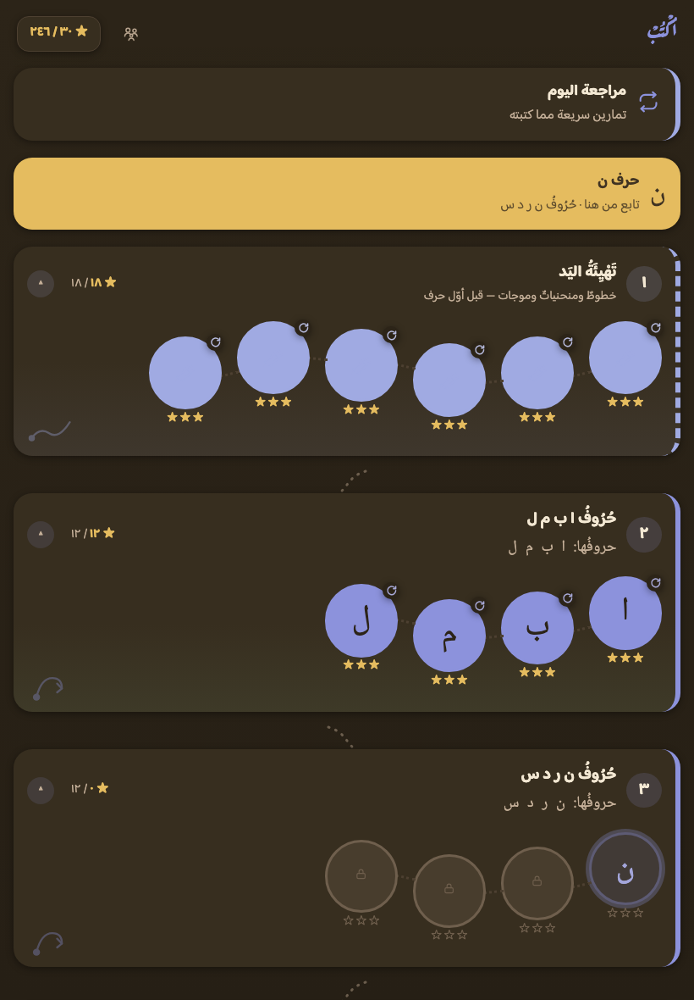</a> الخريطة</td>
<td align="center" width="33%"><a href="identity/doors/night-board.png">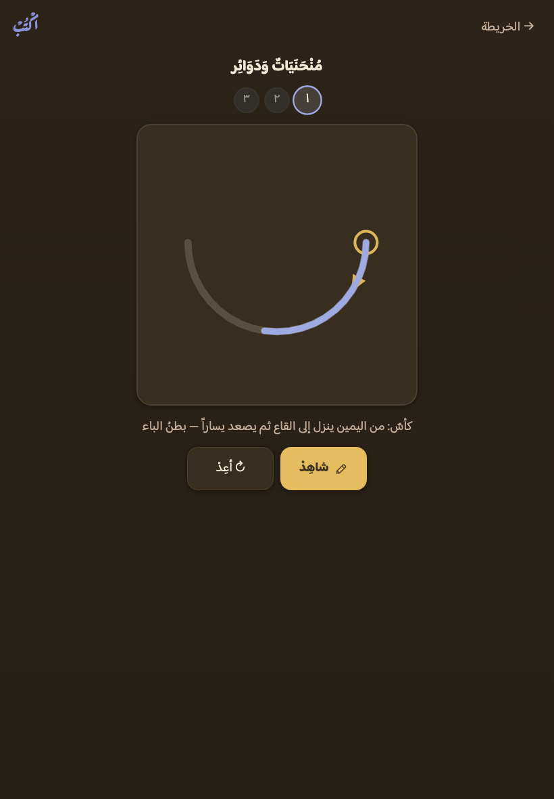</a> لوحُ الكتابة — محاولةٌ وإرشادُها</td>
<td align="center" width="33%"><a href="identity/doors/night-celebrate.png">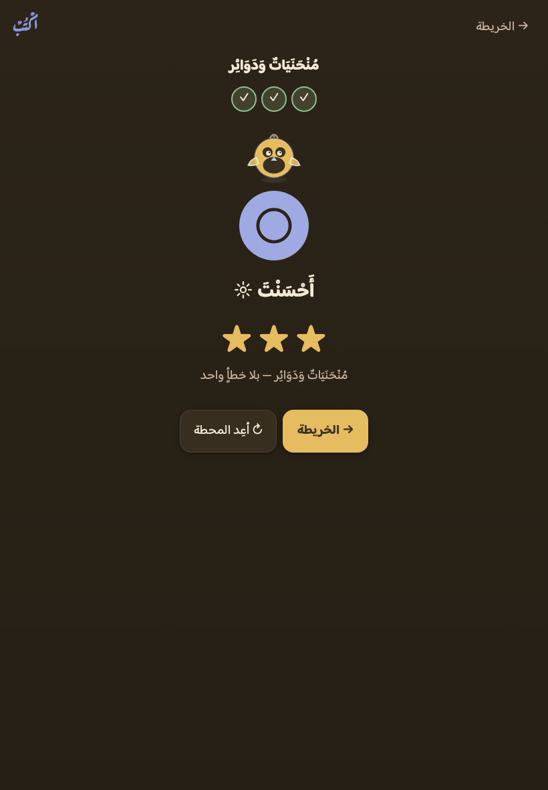</a> الاحتفال</td>
</tr></table>

**واللقطاتُ ليلٌ حقّاً لا صورةٌ مقلوبة**: الوسيطُ `prefers-color-scheme: dark`
يطابق في المتصفّح فعلاً، **وركنُ كلِّ لقطةٍ يُقرأ من الصورة** فيخرج <code>#2C2418</code> · <code>#2C2418</code> · <code>#2C2418</code> — وهو ورقُ الليل في اللوح <code>#2C2418</code> بعينه. فلو غمّق المتصفّحُ الصورةَ من عنده لافترق الرقمان.

**ولم يُمَسّ بعد الإقرار حرف**: اللقطاتُ أعلاه هي اللوحُ نفسُه كما هو —
فالإقرارُ شهادةٌ على المطبَّق لا أمرٌ بتبديله.

<!-- ⇩ يُحفَظ عند إعادة التوليد — بابُ المالك: الليل ⇩ -->
**الحكم**: مُقَرّ — الوجهُ المشتقُّ كما هو (١٢ أغسطس ٢٠٢٦)

والإقرارُ شهادةٌ على المطبَّق: لم يُبدَّل بعده لونٌ ليليٌّ واحد.
<!-- ⇧ ينتهي المحفوظ: الليل ⇧ -->

## ٢. الأيقونة — ✅ **مُقَرّ** (١٢ أغسطس ٢٠٢٦)

**امتحانُ الميثاق** (البند ٢): «تُعرَف من لمحةٍ بين أخواتها… ومحكُّها صفُّ أيقونات
العائلة معاً، وطفلُ سادسةٍ يسمّي كلَّ واحدةٍ بلا تردّد». فصُفَّت بمقاسَي أيقونة
الآيباد (١٥٢ و٧٦ بكسلاً) على أرضٍ محايدة — **وأصولُ الأخوين ملفّاتُهما المنشورة**
تُقرأ من مستودعيهما ولا تُمَسّ:

<a href="identity/doors/icon-row.png">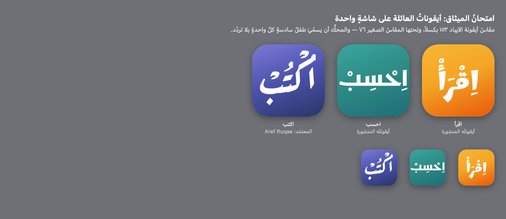</a>

أيقونةُ «اُكْتُبْ» **الكلمةُ كاملةً مشكولةً على تدرّج العلامة** — وهي سنّةُ
العائلة الثلاث: اقرأ واحسب كلتاهما كلمتُها. فالمتبدّلُ في الامتحان **الرسمُ**
(خطُّ العلامة) واللونُ، لا التركيب — وتركيبٌ آخر (حرفٌ واحد، أو قلمٌ مرسوم)
قرارٌ يخرج عن الميثاق إلى تصميمٍ جديد، فلا يُقترح بلا أمر.

**وما تُريه اللقطة بعد التنفيذ**: افترقت الثلاثُ **لوناً ورسماً معاً** —
نِيليٌّ قلميّ (`Aref Ruqaa`) بين برتقاليٍّ مدوّرٍ وفيروزيٍّ هندسيّ. وكان الفارقُ
قبل هذه الجلسة **لوناً وحدَه** لأنّ أيقونتنا وأيقونةَ اقرأ بخطٍّ واحد، وذلك
عينُ ما رفضه الميثاق. **والأيقوناتُ الأربع أُعيدت** بالخطّ المُقَرّ (`make_icons.py`).

**ودَينُ مقاس الحبر أُدِّي** (وقد أدّاه احسب في جلسته): كان مقاسُ الكلمة في
`icon.html` **رقماً ضُبط لحبر Marhey** (٠٫٣٧ من الحيّز الآمن) — يَقُصُّ علامةَ
خطٍّ أعرضَ حبراً ويُقزّم علامةَ خطٍّ أضيق، وقد رأينا الاثنين في لوحة المرشّحين.
فصار **يُقاس بحبر الكلمة نفسِها**: يُرسَم الحبرُ ويُقاس أوسعُ بُعديه، ثم يُضبط
المقاسُ حتى يشغل من علبته ما يشغله حبرُ أخوينا من علبتيهما — **ونسبتُهما مقروءةٌ
من أيقونتيهما المنشورتين لا مكتوبة**:

| الأيقونة | ما يشغله حبرُها من علبتها |
|---|---|
| اقرأ | 0.609 |
| احسب | 0.938 |
| **وسطُهما — وهو ما تلبسه أيقونتُنا** | **0.773** |

<!-- ⇩ يُحفَظ عند إعادة التوليد — بابُ المالك: الأيقونة ⇩ -->
**الحكم**: تُعاد بالخطّ المُقَرّ — `Aref Ruqaa` (١٢ أغسطس ٢٠٢٦)

والتركيبُ سنّةُ العائلة كما عُرِض: الكلمةُ كاملةً مشكولةً على تدرّج العلامة. **والصفُّ أعلاه أُعيد بعد التنفيذ** — وهو خَتمُ هذا الباب.
<!-- ⇧ ينتهي المحفوظ: الأيقونة ⇧ -->

## ٣. الاستعارةُ البطلة — ✅ **مُقَرّ** (١٢ أغسطس ٢٠٢٦)

عالمُ «اُكْتُبْ»: **القلمُ والأثر** (`FAMILY §٩.٣`). ومعالمُ الخريطة اليومَ
معالمُ اقرأ بأعيانها — بيتٌ وجسرٌ وقبةٌ وسلّمٌ وكتاب — وهي بساتينُ أخينا
منسوخة. فتُعرَض هنا مجموعتان مشتقّتان من عالمنا، تُصيَّران **على الخريطة
نفسِها** لا في لوحة رموز.

### ٣أ. معالمُ الخريطة

- **معالمُ اقرأ (ما كان قبل الحكم)** — ما ورثته البذرة: بيتُ الحروف وجسرُ المهارات وقبةُ القرآنية وسلّمُ الجمل ومكتبتُها — **وهي بساتينُ أخينا**. **وأُسقطت بحكم المالك**، ورسمُها مقيَّدٌ هنا ليبقى العمودُ شاهداً على ما كان لا صورةً لما صار.
- **الأثرُ نفسُه** — لغةُ المحرّك مرسومةً: نقطةُ بداية وسهمُ اتجاه وأثرٌ يمتدّ — ما يراه الطفلُ على اللوح في كل محطة، يراه معلماً على الخريطة. فالمعلمُ يقول ما تفعله المحطةُ لا ما تشبهه.
- **مكتبُ الكتابة** — أدواتُ الكتابة كما يعرفها الطفل: كرّاسةٌ مسطّرة وقلمٌ ومِحبرة. عالمٌ مادّيٌّ يُعرَف من لمحة، وأقربُ إلى صورة «مكانٍ» يمشي فيه الطفلُ على الخريطة.

<table><tr>
<td align="center" width="33%"> معالمُ اقرأ (ما كان قبل الحكم)</td>
<td align="center" width="33%"><a href="identity/doors/world-marks-trace.png">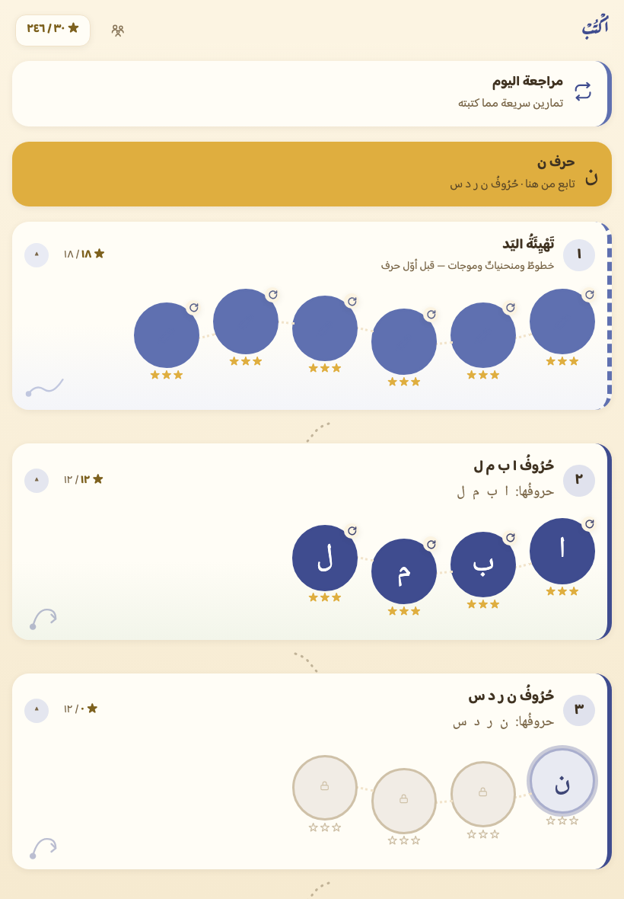</a> الأثرُ نفسُه</td>
<td align="center" width="33%"><a href="identity/doors/world-marks-desk.png">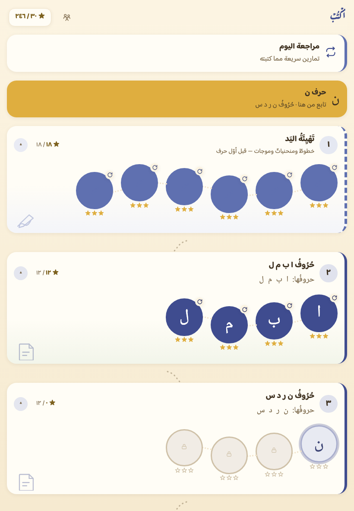</a> مكتبُ الكتابة</td>
</tr></table>

### ٣ب. أسماءُ المراحل

- **كما كانت — «المجموعة الأولى»** — وارثُ ترتيب اقرأ: مجموعاتُ حروفه السبع بأرقامها — **لا عالمَ فيها ولا حروف**. **وأُسقطت بحكم المالك**، ويُبنى هذا العمودُ من `stage.title` في بيان المنهج (وهو باقٍ فيه: المحسوبُ عنوانُ العرض لا البيان).
- **بأثرِها — من عالم القلم** — أسماءٌ من الاستعارة: «أَوَّلُ الأَثَر» ثم «أَثَرٌ يَطُول». تعطي الرحلةَ قصةً، **وتُبعِد الطفلَ عن الحروف نفسِها** — وهو ما يُوزَن.
- **بحروفِها — «حُرُوفُ ا ب م ل»** — الاسمُ يقول ما في المحطة بعينه: حروفُها في عنوانها لا في سطرٍ تحته. **لا استعارةَ فيه**، وهو أنفعُ الثلاثة لطفلٍ يبحث عن حرفه — ويُعرَض ليُوزَن بالنفع لا بالنكهة.

<table><tr>
<td align="center" width="33%"><a href="identity/doors/world-names-now.png">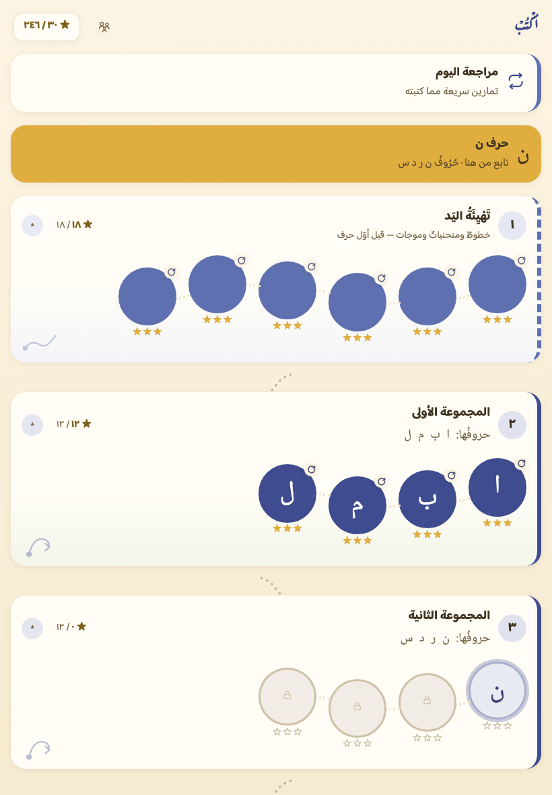</a> كما كانت — «المجموعة الأولى»</td>
<td align="center" width="33%"><a href="identity/doors/world-names-trace.png">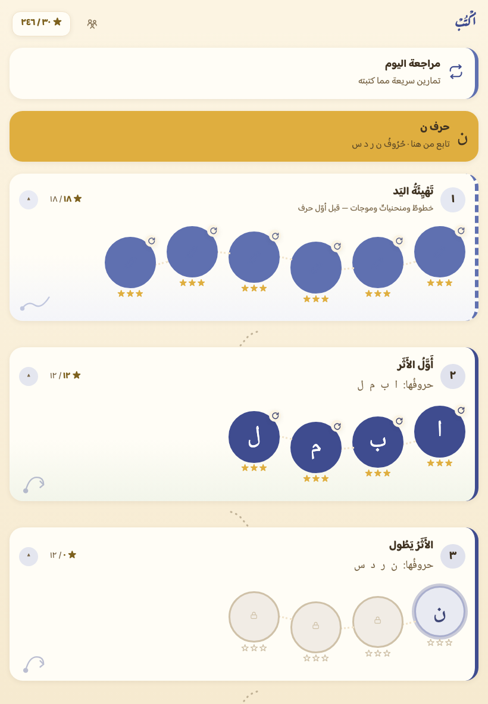</a> بأثرِها — من عالم القلم</td>
<td align="center" width="33%"> بحروفِها — «حُرُوفُ ا ب م ل»</td>
</tr></table>

**ويُقال صريحاً**: مراحلُنا الكبرى **أسماؤها من عالمنا بالفعل** («تَهْيِئَةُ اليَد» ·
«الوَصْلُ وَالنَّسْخ» · «خُفُوتُ النَّمُوذَج») — وإنما المنقولُ عن اقرأ **ترقيمُ مجموعات
الحروف السبع**، وهو ترتيبُه الذي تعهّدنا باتّباعه (`SEED.md`). فالمرشَّحُ الثاني
يكسو الترقيمَ نكهةَ العالم، والثالثُ يستبدل به **حروفَ المحطة نفسَها** — وهو
أنفعُ للطفل وأبعدُ عن الاستعارة معاً، فليختر المالكُ بين النكهة والنفع.

### ٣ج. نكهةُ الاحتفال

- **كما كانت — أيقونةُ قلمٍ محايدة** — الميداليةُ اليومَ `icon('pen')` — **وهو وجهُ عقدة التهيئة نفسُه** الذي تعلنه `nodeFace`، فالحالُ اليومَ صحيحةٌ لا خاطئة. وإنما تظهر الحاجةُ يومَ تُبنى محطاتُ الحروف (الجلسة ٥): يومَها يصير قلمٌ واحد وجهاً لثمانيةٍ وعشرين حرفاً.
- **وجهُ العقدة — ما كُتب الآن** — سنّةُ اقرأ في ميداليتها: يحمل قرصُ الختام **ما تعلّمه الطفلُ الآن** — وهو في محطة تهيئةٍ شكلُها المرجعيّ (في اللقطة)، وفي محطة حرفٍ **الحرفُ نفسُه** كما تعلنه `nodeFace` بالفعل. بيانٌ لا يد: الميداليةُ تقرأ ما تعلنه العقدة.
- **أثرُ الطفل نفسُه** — ما لا يملكه أخوانا: الميداليةُ تحمل **الأثرَ الذي كتبه هو قبل ثانية** — حبرَه لا حبرَ النموذج، تُنسَخ عقدُه المرسومةُ على اللوح إلى قرص الميدالية. وهو أنسبُ ما يكون لتطبيقٍ بطلُه الأثر، **ولا يخرج المسارُ من الجهاز** لأنه لا يبرح الشاشة.

<table><tr>
<td align="center" width="33%"><a href="identity/doors/world-celebrate-now.png">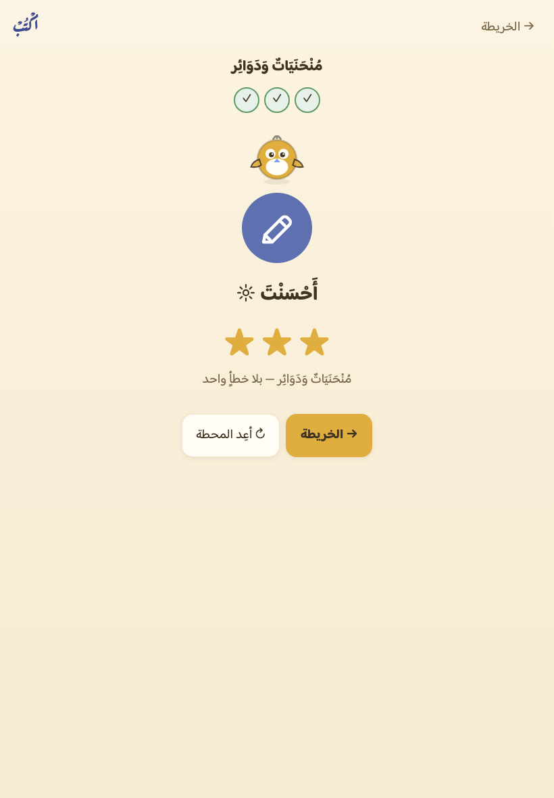</a> كما كانت — أيقونةُ قلمٍ محايدة</td>
<td align="center" width="33%"> وجهُ العقدة — ما كُتب الآن</td>
<td align="center" width="33%"><a href="identity/doors/world-celebrate-trace.png">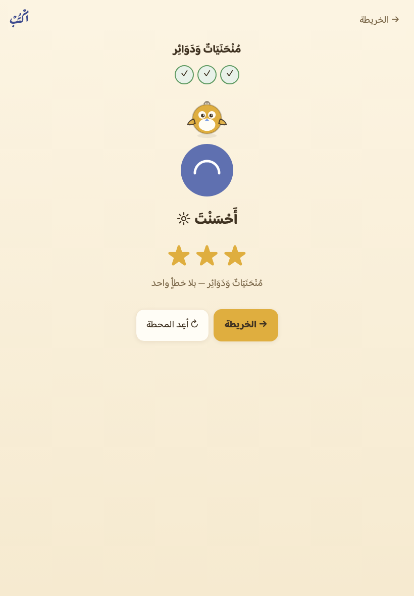</a> أثرُ الطفل نفسُه</td>
</tr></table>

**ويُقال صريحاً عن اللقطتين الثانية والثالثة**: يكاد الأثران يتطابقان فيهما —
لأنّ الإصبعَ المصنوع في العدّة يكتب على المسار المرجعيّ بعينه. **ويدُ طفلٍ حقيقيّ
تفارقه**، وذلك هو المقصود من الثالث: يرى الطفلُ في ميداليته **يدَه هو** لا نموذجاً
مرسوماً — والفرقُ بينهما لا يُرى في لقطةٍ آلية، ويُرى في يد طفل.

**والثالثُ لا يمسّ عهداً**: مسارُ الطفل لا يغادر الصفحةَ فضلاً عن الجهاز — تُنسَخ
عقدُ حبره المرسومةِ على اللوح إلى قرص الميدالية، ولا يُخزَّن ولا يُرسَل
(`METHOD §٣.٧`، و`pen.js` لا يعرف الشبكة بنيوياً). **ولا نصَّ منطوقاً جديداً في
المرشّحات الثلاثة**: صوتُ المعلّم واحدٌ للعائلة، والاحتفالُ لا يُنطق فيه جديد.

<!-- ⇩ يُحفَظ عند إعادة التوليد — بابُ المالك: الاستعارة ⇩ -->
**الحكم**: (١٢ أغسطس ٢٠٢٦) — **معالمُ الخريطة**: «الأثرُ نفسُه» · **أسماءُ المراحل**: «بحروفِها» (**تُحسب من `curriculum.js` لا تُكتب**) · **نكهةُ الاحتفال**: «أثرُ الطفل نفسُه».
<!-- ⇧ ينتهي المحفوظ: الاستعارة ⇧ -->

## ٤. العلامة — ✅ **مُقَرّ** (١٢ أغسطس ٢٠٢٦)

«لكل تطبيقٍ رسمُ علامته وخطُّها قرارَ مراجعةٍ يُقَرّ — **وخطُّ Marhey لعلامة اقرأ
وحدَها فلا يُورَّث بالنسخ**» (`FAMILY §٩.٤`).
**وعلامتُنا اليومَ بخطّ `Aref Ruqaa`** بحكم المالك — والنائبُ أُسقط من اللوح
ومن الشجرة ومن قشرة العامل، فلا يبقى على جهاز طفلٍ وزنٌ ميتٌ لعلامة أخينا.

<a href="identity/doors/fonts-board.png">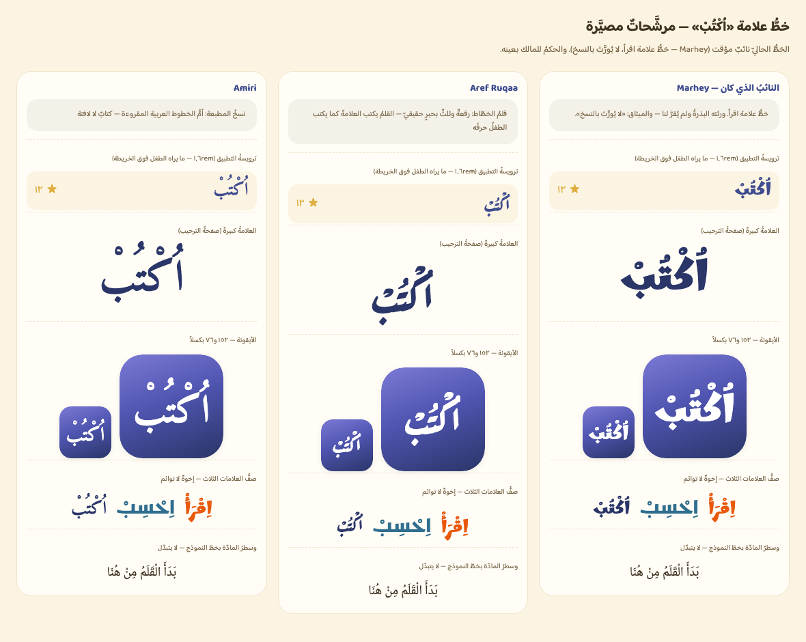</a>

**والأرضياتُ من العائلة لا من ذوقٍ** — كم يكفي من الفرق بين خطَّي علامتين؟
الجوابُ سابقةٌ لا عتبة: **بُعدُ خطّ اقرأ عن خطّ احسب** — فرقٌ حكم به مالكان فعلاً
وصفّته العائلةُ على شاشةٍ واحدة. وكذلك «ألّا تُشبه العلامةُ خطَّ المادّة»:
أرضيتُها **بُعدُ علامة اقرأ عن خطّ مادّتها** في بيته.

| الأرضية | ما هي | قيمتُها |
|---|---|---|
| تمايزُ العلامتين | Marhey (اقرأ) عن Kufam (احسب) | **71٪** |
| مفارقةُ خطّ المادّة | Marhey عن Noto Naskh في بيت اقرأ | **50٪** |

**والقياسُ نفسُه**: تُصيَّر كلمةُ العلامة «اُكْتُبْ» بكلّ خطٍّ في ورقةٍ واحدة
([`identity/doors/word-sheet.png`](identity/doors/word-sheet.png))، ثم يُقَصّ حبرُ كلِّ كلمةٍ ويُوحَّد
مقاسُ علبته، ويُقابَل بحبر الآخر بكسلاً بكسل: **ما لا يتقاطع ÷ مجموعِهما**. فالمقيسُ
**شكلُ الكلمة** لا مقاسُها — والعينُ تفرّق بالشكل.

| المرشَّح | عن Marhey (اقرأ) | عن Kufam (احسب) | عن خطّ المادّة | وزنٌ غليظ | حِملُه | تشكيلٌ فوق الحروف |
|---|---|---|---|---|---|---|
| **Aref Ruqaa** | 76٪ | 86٪ | 79٪ | ✓ وزنان | ٨٢ ك.ب | 13٪ من ارتفاع الكلمة |
| **Amiri** | 80٪ | 89٪ | 75٪ | ✓ وزنان | ٢٠٤ ك.ب | 26٪ من ارتفاع الكلمة |

**Aref Ruqaa** — *قلمُ الخطّاط: رقعةٌ وثلثٌ بحبرٍ حقيقيّ — القلمُ يكتب العلامةَ كما يكتب الطفلُ حرفَه* (Abdullah Aref · Khaled Hosny — OFL)

- **لماذا**: استعارةُ التطبيق البطلة مرسومةٌ في الخطّ نفسِه: الحبرُ يغلظ في المنحنى ويرقّ في الطرف، فتُقرأ العلامةُ **أثرَ قلمٍ لا شكلاً مطبوعاً**. وحركاتُه ظاهرةٌ فوق حروفه — والعلامةُ عندنا مشكولةٌ بالكامل.
- **وما يُخشى منه**: رقعةٌ، والخطُّ المرجعيّ في المنهج **نسخٌ مدرسيّ** (`METHOD §٢`، والرقعةُ أفقٌ مؤجَّل معلَن). فإن قرأ طفلٌ العلامةَ نموذجاً التبس عليه ما يُكتب بما يُقرأ — ويعصمه أنّ خطَّ العلامة **لا يُكتب به نصٌّ ولا مادّة** (`DESIGN §٣`)، والعلامةُ لا تظهر على لوحٍ ألبتّة.

**Amiri** — *نسخُ المطبعة: أمُّ الخطوط العربية المقروءة — كتابٌ لا لافتة* (Khaled Hosny — OFL (على نسخ مطبعة بولاق))

- **لماذا**: أوضحُهما تشكيلاً وأصدقُهما رسماً للحرف، ولها من الوقار ما يليق باسمٍ أمرُه «اُكْتُبْ». وهي **من بيتٍ لا يسكنه أخ**: لا رقعةَ اقرأ المدوّرة ولا كوفيَّ احسب.
- **وما يُخشى منه**: نسخٌ — وخطُّ المادّة عندنا نسخٌ كذلك (Noto Naskh). فقد تُقرأ العلامةُ سطرَ مادّةٍ لا علامة، **وهذا يُقاس لا يُوصَف**: بُعدُ رسمها عن رسم خطّ المادّة في الجدول أدناه، وأرضيتُه بُعدُ علامةِ اقرأ عن خطّ مادّتها.

**وجُرّب ٢٨ خطّاً فسقط ٢٦ قبل العرض** — وكلُّ علّةٍ تُقاس
مقيسةٌ في الجدول أدناه، لا موصوفة:

| الخط | العلّة | شاهدُها |
|---|---|---|
| Aref Ruqaa Ink | أخو المرشَّح الأول ومعه حبرٌ ملوّن — جُرّب لأن استعارته استعارتُه. **وهو خطٌّ ملوّنٌ بنفسه** (COLRv1): يرسم حبرَه بألوانه لا بلون العلامة، فلا يلبس هويةَ اللوح ولا يتبع ليلاً ونهاراً. | **100٪** من حبره ليس بلونٍ واحد |
| Qahiri | كوفيٌّ مربّعٌ خفيفُ الحِمل — جُرّب طلباً لرسمٍ لا يشبه أحداً. **والعلامةُ لا تُقرأ فيه**: أشكالٌ هندسيةٌ متلاصقة، ولا يعلو الحروفَ تشكيلٌ ألبتّة — وعلامتُنا مشكولةٌ بالكامل. | لا يعلو حروفَه تشكيلٌ يُذكَر: **0٪** من ارتفاع الكلمة |
| Vibes | زخرفيٌّ رفيع جُرّب لتمايزه الظاهر — ولا يعلو حروفَه تشكيلٌ ألبتّة، ووزنُه واحد. | لا يعلو حروفَه تشكيلٌ يُذكَر: **0٪** من ارتفاع الكلمة |
| Rakkas | لافتةٌ عربيةٌ عريضة جُرّبت لغِلَظ حبرها — وتشكيلُها يكاد لا يعلو الحروف، ووزنُها واحد بلا محور. | لا يعلو حروفَه تشكيلٌ يُذكَر: **1٪** من ارتفاع الكلمة |
| Gulzar | نستعليقٌ كاملُ الرسم — **وأبعدُ ما جُرّب عن خطَّي الأخوين بالقياس**، غير أنّ سطرَه ينحدر فلا يستقيم في مربّع أيقونة، **ووزنُه واحد بلا محور** وحِملُه ١٨٧ كيلوبايت لذلك الوزن وحدَه. | وزنٌ واحد في مصدره — لا ملفَّ غليظٍ ولا محور |
| Amiri Quran | أخو المرشَّح الثاني برسم المصحف — **و«اُكْتُبْ» لا نصَّ مصحف فيه** (خطُّ المصحف لم يُنقَل من البذرة أصلاً، `SEED.md`)، ووزنُه واحد بلا محور. | وزنٌ واحد في مصدره — لا ملفَّ غليظٍ ولا محور |
| Lalezar | لافتةٌ ثقيلةُ الحبر — **وزنٌ واحد بلا محور**، فالغِلَظُ يُصطنع اصطناعاً وتشويهُ رسمٍ لا يليق بعلامة. وقد ردّه احسب قبلنا بهذه العلّة بعينها. | وزنٌ واحد في مصدره — لا ملفَّ غليظٍ ولا محور |
| Alkalami | اسمُه «القلميّ» واستعارتُه استعارتُنا، فجُرّب على اسمه — **ووزنُه واحد بلا محور**، ورسمُ كانو المضغوط يزحم حركاتِ العلامة. | وزنٌ واحد في مصدره — لا ملفَّ غليظٍ ولا محور |
| Readex Pro | **كان مرشَّحاً معروضاً حتى ردّه القياس**: حديثٌ عريضٌ واضح في المقاسات الصغيرة، محورُه حقيقيّ وحِملُه من أخفّ ما جُرّب. غير أنّ صورةَ علامته لا تبعد عن صورة علامة اقرأ بقدر ما تبعد علامةُ اقرأ عن علامة احسب — وهو نصُّ الميثاق: «تُعرَف من لمحةٍ بين أخواتها». | على **53٪** من خطّ أخٍ — دون الأرضية 71٪ |
| Lemonada | مدوّرٌ مكتنز من بيت العلامات لا بيت المتون — ولم يبلغ أرضيةَ التمايز، وأقربُ ما يكون إلى كوفيّ احسب. وقد ردّه احسب قبلنا لقربه من Marhey. | على **51٪** من خطّ أخٍ — دون الأرضية 71٪ |
| Reem Kufi | كوفيٌّ هندسيٌّ خفيف — **بيتُ احسب رسماً** (Kufam)، ولم يبلغ الأرضيةَ عن خطّ اقرأ بفارقٍ ضئيل. | على **70٪** من خطّ أخٍ — دون الأرضية 71٪ |
| Noto Kufi Arabic | كوفيٌّ كذلك وبيتُه بيتُ احسب — ولم يبلغ الأرضية، وحِملُه عشرةُ أضعاف أخفِّ ما جُرّب. | على **58٪** من خطّ أخٍ — دون الأرضية 71٪ |
| Scheherazade New | نسخٌ تعليميٌّ واسعُ الانتشار جُرّب لصدق رسمه للحرف — ولم يبلغ أرضيةَ التمايز عن خطّ اقرأ. **وهو أقربُ ما جُرّب إلى خطّ المادّة** وإن لم ينزل تحت أرضيتها. | على **61٪** من خطّ أخٍ — دون الأرضية 71٪ |
| Harmattan | نسخٌ غربُ أفريقيٍّ خفيفُ الحبر — لم يبلغ الأرضيةَ عن الأخوين، وحِملُه ربعُ ميغابايت على جهازٍ يعمل دون إنترنت. | على **64٪** من خطّ أخٍ — دون الأرضية 71٪ |
| Lateef | نسخٌ قلميٌّ من بيت SIL جُرّب لقربه من استعارتنا — ولم يبلغ الأرضية. | على **63٪** من خطّ أخٍ — دون الأرضية 71٪ |
| Cairo Play | لعوبٌ متغيّرُ الرسم جُرّب لأن مخاطَبَنا طفل — ولم يبلغ الأرضيةَ عن خطّ اقرأ ولا عن خطّ احسب. | على **61٪** من خطّ أخٍ — دون الأرضية 71٪ |
| Alexandria | ردّه اقرأ في لوحة خطّ welcome (رفيقُ Montserrat اللاتينيّ بنصّ مصدره) — والقياسُ يردّه هنا كذلك: **أقربُ ما جُرّب إلى خطّ اقرأ**. | على **48٪** من خطّ أخٍ — دون الأرضية 71٪ |
| Mirza | نستعليقٌ مخفَّف: سطرُه ينحدر، ولم يبلغ الأرضية. | على **51٪** من خطّ أخٍ — دون الأرضية 71٪ |
| Blaka | حبرٌ سائلٌ متلاصق — الحركاتُ تكاد تلتحم بالحروف، ولم يبلغ الأرضية، ووزنُه واحد. | على **51٪** من خطّ أخٍ — دون الأرضية 71٪ |
| Jomhuria | لافتةُ شارعٍ ضاغطة: حبرٌ مضغوطٌ متلاصق — ولم يبلغ الأرضية، ووزنُه واحد. | على **45٪** من خطّ أخٍ — دون الأرضية 71٪ |
| Katibeh | رفيعٌ خفيفٌ بوزنٍ واحد يذوب في الشريط وفي الأيقونة — ولم يبلغ الأرضية. | على **57٪** من خطّ أخٍ — دون الأرضية 71٪ |
| Changa | ردّه احسب قبلنا (أرقامٌ مربّعةٌ تفارق أشكال المشرق) — والقياسُ يردّه هنا بالأرضية. | على **58٪** من خطّ أخٍ — دون الأرضية 71٪ |
| El Messiri | ردّه اقرأ في لوحة خطّ welcome — ولم يبلغ الأرضيةَ عندنا. | على **59٪** من خطّ أخٍ — دون الأرضية 71٪ |
| Tajawal | خطُّ متنٍ محايد تخرج به العلامةُ سطرَ واجهةٍ لا علامة (ردّه احسب بهذه العلّة) — ولم يبلغ الأرضية. | على **61٪** من خطّ أخٍ — دون الأرضية 71٪ |
| Almarai | خطُّ متنٍ محايد كذلك — علّتُه علّةُ Tajawal، ولم يبلغ الأرضية. | على **56٪** من خطّ أخٍ — دون الأرضية 71٪ |
| Mada | خطُّ واجهةٍ رفيعٌ محايد: لا حبرَ فيه يليق باسمٍ فعلُه الكتابة — ولم يبلغ الأرضية. | على **50٪** من خطّ أخٍ — دون الأرضية 71٪ |

**وملفّاتُ الخطوط كلِّها في `tools/fonts/`** (٢٨ خطّاً) — **لا تُنشَر
ولا تدخل قشرةَ التطبيق**: منها تُقاس الأرقامُ أعلاه، فتُقرأ العلّةُ من الملفّ لا من
الذاكرة. **ويُسقَط الخاسرون بعد الحكم** (سنّةُ اقرأ في لوحة خطّها: لا وزنَ ميتاً
يُصان)، ويبقى المُقَرُّ وحدَه في `app/fonts/`.

**وما نُفِّذ بالحكم** (والدَّينُ الذي كان معلَناً قبله أُدِّي معه):

1. ملفّا الخطّ في `app/fonts/` **محلّيَّين لا مورداً خارجياً** (ووزناه مرسومان
   لا محورَ فيهما، فلكلٍّ ملفُّه ولا يُصطنع غِلَظٌ بتشويه رسم)، وفي قشرة `sw`
   برفعةِ نسخة — **وملفُّ النائب أُسقط منهما معاً**.
2. `--font-brand` في اللوح، **وقاعدةُ `.brand` صارت تقرأ الرمز** بعد أن كانت
   تكتب الاسمَ بيدها، **و`icon.html` يقرأ الخطَّ من اللوح** بعد أن كتبه ثلاثاً.
3. **وحارسان كانا يحرسان اسماً**: `browser_test.html` صار يسأل الشاشةَ «أوصل
   ما يعلنه `--font-brand` إلى الكلمة فعلاً؟»، و`cdn_check.py` يجرد ملفَّ الخطّ
   من اللوح — ولولا ذلك لمرّا أخضرين على علامةٍ بلا خطّها.
4. والأيقوناتُ الأربع أُعيدت بالخطّ المُقَرّ.

**والجردُ يشهد**: اسمُ الخطّ لم يبقَ مكتوباً بيدٍ في شيفرةٍ تعمل إلا في
**٣** مواضعَ، كلُّها **في اللوح نفسِه** (وجهاه وسطرُ رمزه) — ومنه
يقرؤه الجميع:

`app/css/app.css:٤٥` · `app/css/app.css:٥٥` · `app/css/app.css:١٠٦`

<!-- ⇩ يُحفَظ عند إعادة التوليد — بابُ المالك: العلامة ⇩ -->
**الحكم**: Aref Ruqaa (١٢ أغسطس ٢٠٢٦)

وملفُّه **يُضمّ محلياً** في `app/fonts/` كسنّة العائلة — صفرُ موردٍ خارجيّ، والتطبيقُ يعمل دون إنترنت.
<!-- ⇧ ينتهي المحفوظ: العلامة ⇧ -->

> **وطائرُ العلامة** (مؤجَّلٌ من الجلسة ٠): في اقرأ يحطّ «نوري» على رأس ألف
> «اِقْرَأْ» لأن كسرتَها تحتها، **وألفُ «اُكْتُبْ» ضمّتُها فوقها** فيحجب الطائرُ
> التشكيلَ الذي هو تمايزُ العلامة. ولم يُعرَض له تركيبٌ هنا: **موضعُه تابعٌ لرسم
> الخطّ** — فارتفاعُ الضمّة وميلُها يختلفان من مرشَّحٍ إلى مرشَّح، ورسمُ تركيبٍ
> قبل الحكم رسمٌ يُعاد. **وقد حُكم للخطّ** (`Aref Ruqaa`)، فصار موضعُ الطائر
> قابلاً للرسم على ضمّةٍ معلومة — **ويُفتَح مع صفحات الترحيب** (الجلسة ١١)،
> فهي أوّلُ موضعٍ تُرى فيه العلامةُ كبيرةً بحجمٍ يسع طائراً.

## ٥. حارسُ الهوية — ✅ `tools/test_identity.mjs`

«فحصٌ في كل تطبيقٍ يثبت أن قيمَ لوحه الأساسية (الورق والغالب) **تخالف** قيمَ اقرأ
المعلومة — فالوجهُ المستعار يحمرّ يومَ يُنسى لا يومَ يُلاحَظ» (`FAMILY §٩`).
وأصلُه حارسُ احسب (`calc@9ee001c:tools/test_identity.mjs`) — نُقل بحرّاسه وعُدِّل
لحالنا، وقيدُه في `SEED.md`.

| الباب | ما يثبته |
|---|---|
| الورق | `--paper` و`--paper-deep` يخالفان ورقَ اقرأ قيمةً |
| الغالب | `--accent-letters` و`--brand-1..3` تفارق غالبَ اقرأ **بُعداً تراه العين** |
| والغالبُ غالبُنا حقّاً | `--accent` يشير إلى `--accent-letters` — فلا يُقاس رمزٌ ليس هو الغالب |
| الذهبُ مشتركٌ **بعلّةٍ معلنة** | `--star` عندنا **لونُ حكمٍ** (الإرشاد: `.pen-start`/`.pen-arrow`) لا لونٌ غالب — فيبقى ذهبَ العائلة، ويُشترَط أن يبقى الإرشادُ قارئاً له |
| خطُّ العلامة | ما دام حكمُ §٤ منتظَراً **لزم أن يبقى النائبُ معلَناً في هذه الصفحة**؛ ويومَ يُكتب الحكمُ ينقلب الشرط: يلزم أن يلبسه اللوحُ وألّا يبقى لخطّ اقرأ حِملٌ في شجرتنا |
| البصمة | قيمُ اقرأ **من التزامٍ مبصوم**، وتُقابَل بمستودعه إن وُجد (بابٌ نائمٌ يستيقظ ذاتياً) |

## ٦. سجلُّ الاعتماد

| الباب | الحال | التاريخ |
|---|---|---|
| اللوح | ✅ **`indigo / shift`** — حكمُ المالك على لوحةٍ مصيَّرة، ومطبَّق | ١٢ أغسطس ٢٠٢٦ |
| وجهُ الليل | ✅ **مُقَرّ** (١٢ أغسطس ٢٠٢٦) — مشتقٌّ ومطبَّق، ولقطاتُه معروضة | ١٢ أغسطس ٢٠٢٦ |
| الأيقونة | ✅ **مُقَرّ** (١٢ أغسطس ٢٠٢٦) — امتحانُ الصفّ لقطةً | ١٢ أغسطس ٢٠٢٦ |
| الاستعارة | ✅ **مُقَرّ** (١٢ أغسطس ٢٠٢٦) — ثلاثةُ أبوابٍ مصيَّرة | ١٢ أغسطس ٢٠٢٦ |
| العلامة | ✅ **مُقَرّ** (١٢ أغسطس ٢٠٢٦) — خطّان مصيَّران ومقيسان من ٢٨ جُرِّبت | ١٢ أغسطس ٢٠٢٦ |
| حارسُ الهوية | ✅ قائمٌ ومجرَّبٌ سالباً، وفي السَّوقة بالجرد | ١٢ أغسطس ٢٠٢٦ |
